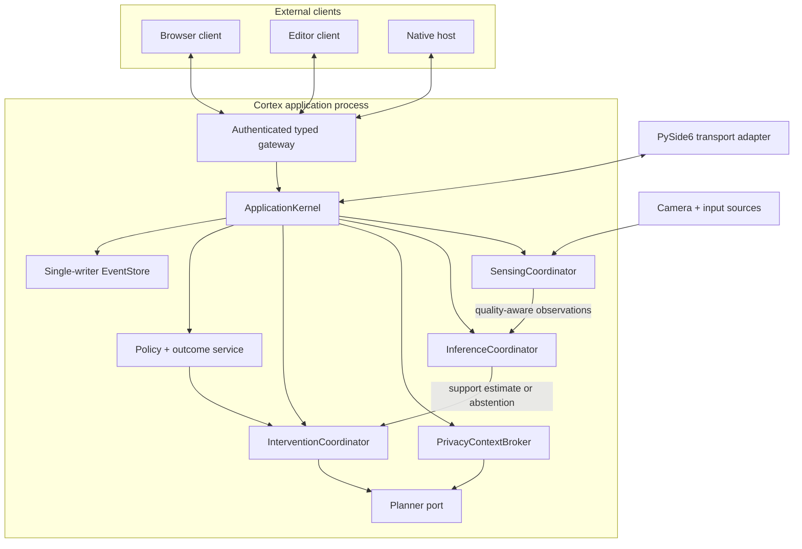
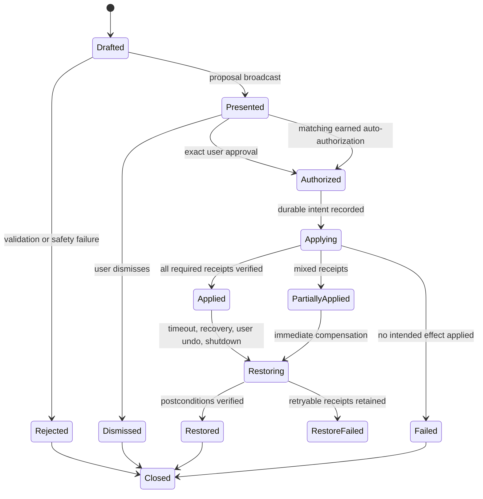
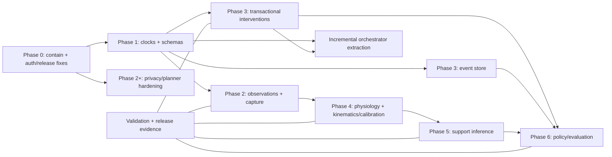

# Cortex: Rigorous Algorithm, Architecture, and Implementation Plan

**Status:** release-relevant software implementation complete through WP-11;
credentialed release-candidate, reference-sensor, participant, and independent-review
gates remain external

**Historical audit snapshot:** `fac5db965b0568a73ea64d78fbb6eb594080073c`
on `main`, reviewed 2026-08-24

**Implementation record:** `implementation-hardening`, implemented and verified
through 2026-08-25; immutable WP commits are listed in
[`audit/execution-log.md`](audit/execution-log.md)

**Scope:** macOS application, in-process daemon, HTTP/WebSocket gateways, webcam physiology and kinematics, state inference, intervention planning/execution/restoration, adaptive policy evaluation, Chrome/Edge extension, optional VS Code extension, persistence, packaging, tests, documentation, privacy, and supply chain

**Audience:** maintainers implementing the next correctness and architecture milestone

---

## 0. Document state and completion boundary

This is both the original repository audit and the implementation record that
closed it. Sections 1–11 preserve the as-built evidence and design reasoning at
the historical snapshot above; present-tense defect descriptions in those
sections must not be read as claims about the hardened branch. Sections 12,
15, and 18 record implementation and closure. Current operational truth lives
in the [architecture](Architecture.md), [limitations](docs/limitations.md),
[data-flow](docs/data-flow.md), and [release evidence](docs/release/README.md)
documents.

The high-impact software boundary is complete. Cortex is now a local modular
monolith with explicit application coordinators, evidence-aware deterministic
support inference, exact authorization and receipt-backed restoration,
transactional SQLite authority, a privacy context broker, deterministic product
policy, separately governed research evaluation, and a reproducible release
pipeline. “Complete” here does not mean clinically validated, independently
audited, or already shipped as a signed/notarized artifact.

| Boundary | Implemented result | Remaining evidence, if any |
| --- | --- | --- |
| User authority | Inert proposal → exact manifest authorization → apply receipt → postcondition verification → idempotent restore | Per-release installed-artifact exercise remains mandatory |
| Signals and inference | Explicit missingness/quality, unique beat timeline, time-correct kinematics, deterministic abstaining support estimate; unsupported medical/physiology claims are unavailable | Reference-sensor and participant-held-out data are required before adding physiological accuracy claims |
| Architecture and storage | Typed kernel/coordinators, named task ownership, one desktop domain path, bounded browser modules, transactional SQLite authority and recovery | None at the source-code boundary |
| Policy and evidence | Deterministic production policy and exactly-once outcomes; consented fixed MRT/OPE research path with immutable exports and diagnostics | Independent statistical review and any human-subject approvals remain external |
| Privacy and UI | Exact redacted preview, one-time external send, optional permissions, semantic tokens, keyboard/accessibility/reduced-motion contracts, restrained feedback and interruption behavior | Real-user usability/accessibility studies remain external |
| Supply chain and release | Universal `uv.lock`, exact Python/Node/pnpm/uv pins, frozen installs, audited dependency exceptions, dual-architecture workflow, SBOMs, attestations, signing/notarization/stapling verification, mounted smoke, draft staging, and fail-closed evidence promotion | Apple credentials, protected release/publish environments, x86_64 runner, independent reviewers, and the physical TCC/device matrix are required per candidate |
| Documentation and governance | Tracked finding ledger/ADRs, generated 203-setting reference and safe env template, version/schema/design-token/config/link/action-pin contracts | External links and audit exceptions continue to be scheduled, time-varying gates |

The UI implementation applies the interaction principles from
[Emil Kowalski’s design-engineering skills](https://github.com/emilkowalski/skills):
motion communicates state rather than decorates it; transitions remain short,
interruptible, and reduced-motion aware; destructive or authority-bearing
actions are explicit; visual hierarchy uses semantic tokens; and every polished
surface retains keyboard, focus, contrast, and assistive-name contracts. WP-9
contains the implementation evidence rather than treating the reference as a
style-only checklist.

### 0.1 Verification snapshot

The final working tree was exercised with locked dependencies:

- Python 3.11.15 and 3.12.13: Ruff, strict mypy over 510 source files,
  a verified 281-file wheel, 2,548 non-Qt tests passed with 3 declared skips, and
  62 isolated Qt tests passed on each interpreter. The local 3.12 execution was
  arm64; CI and release contracts require the 3.12.13 row on x86_64 and assert
  both exact interpreter and architecture.
- Browser: a clean pnpm 9.15.9 frozen install, TypeScript check, 248 Vitest
  tests, and Chrome/Edge MV3 production builds.
- VS Code: clean `npm ci`, TypeScript compile, 30 Jest tests, zero npm audit
  findings, and a packaged 0.2.2 VSIX.
- Contracts/evaluation: generated Python→TypeScript schemas, design tokens,
  versions, configuration docs, 203-setting reachability, local Markdown links,
  workflow action/tool pins, and all four committed replay-regression metrics.
- Dependency policy: zero known Python and VS Code findings; 11 browser
  build/test-chain advisories are path-constrained, expiry-bounded, reviewed
  exceptions after patchable critical/high transitive versions were lifted.

No signed DMG, Apple notarization response, physical camera/TCC matrix,
reference-sensor dataset, participant study, penetration test, or independent
statistical review was fabricated during this work. The repository now makes
those gates executable and evidence-bearing; the parties with credentials,
hardware, data authority, or independence must execute them.

## 1. Executive determination

Cortex has a credible product shape and several good engineering foundations: local-first capture, no raw-frame persistence in the normal path, explicit signal-quality objects, a consent vocabulary, reversible adapters, localhost capability-token authentication, schema generation for much of the daemon/browser boundary, extensive Python and browser tests, clean static analysis, and thoughtful macOS packaging work.

At the historical audit snapshot, the implementation did **not** support
several of its strongest behavioral and physiological claims. Four classes of
issue were release-critical:

1. **A real native-messaging authentication contract mismatch prevents the browser from accepting the token returned by the Python host.** Python emits `token`; TypeScript accepts only `auth_token`. Each side's isolated tests encode its own incompatible shape.
2. **Consent downgrade is treated as permission to execute the original higher-level action, and mutations occur before the plan is presented.** Both browser and VS Code clients also apply workspace changes as soon as `INTERVENTION_TRIGGER` arrives. The implemented path is therefore not a true preview/approval transaction.
3. **The physiological feature path can manufacture or duplicate evidence.** Overlapping rPPG windows repeatedly insert the same inter-beat intervals; global beat order is wrong; missing face samples are interpolated without a window missingness limit; the successful face-tracking path makes measured nose displacement zero; and the respiration band cannot produce the rate that the code labels as an apnea condition.
4. **The adaptive-policy report is descriptive, not causal.** Policy matrices are not durably restored, a decision can receive multiple reward updates, the no-action arm is not followed to an outcome, and the current IPS/SNIPS and excursion calculations do not define or estimate a defensible target-policy or proximal causal estimand.

The immediate product posture at that snapshot was therefore:

- default to **suggest-only** behavior;
- require a new authorization record for every workspace mutation;
- suppress external HRV, LF/HF, “apnea,” and physiology-driven break claims until the signal pipeline passes reference-sensor validation;
- describe state outputs as **support-need estimates** or **overwhelm-support scores**, not measurements of a medical or neurological condition;
- freeze online policy learning outside an explicitly consented research mode;
- retain the current modular-monolith deployment and replace the large orchestrators incrementally, not with network microservices.

This was containment, not abandonment. WP-0 through WP-11 implemented the
repair without discarding the existing UI, capture adapters, schemas, or most
domain services.

### 1.1 Release-blocking gates

| Gate                             | Observed evidence                                                                                                       | Required exit condition                                                                                                              |
| -------------------------------- | ----------------------------------------------------------------------------------------------------------------------- | ------------------------------------------------------------------------------------------------------------------------------------ |
| G0: native auth                  | `native_host.py` returns `{status, token}` while `lib/auth.ts` reads `auth_token`                                       | One generated response schema, one canonical field, Python↔TypeScript golden contract test, installed-host smoke test                |
| G1: consent exactness            | `ConsentDecision.allowed` may be true after downgrade; daemon and executor ignore `effective_level`                     | A decision is `PERMIT`, `DOWNGRADE`, or `DENY`; only an exact permit or a newly materialized lower-level plan may execute            |
| G2: presentation before mutation | daemon calls `executor.apply()` before `send_intervention()`; browser and VS Code mutate on trigger                     | `PROPOSED → PRESENTED → AUTHORIZED → APPLYING`; trigger/presentation handlers are side-effect free except rendering                  |
| G3: reliable undo                | reversals call adapters with `{}` rather than a recorded action receipt; outcome start time is written at end           | Every applied action emits a durable receipt containing exact inverse data; restart-safe, idempotent restore is verified             |
| G4: clock contract               | public schemas say UNIX epoch while the state loop constructs feature/state objects with `time.monotonic()`             | Separate wall and monotonic fields; generated contracts reject ambiguous `timestamp`; fake-clock tests cover restart and long uptime |
| G5: signal validity              | duplicated/reordered IBI history, missingness interpolation, dead motion measure, unreachable low-respiration condition | Continuous beat timeline, explicit observation masks, time-based kinematics, valid respiration design, replay/reference validation   |
| G6: release integrity            | VS Code lockfile is ignored although CI runs `npm ci`; its Jest command is invalid; runtime `ws` has a high advisory    | Tracked lockfile, tests run in CI, fixed `ws`, frozen installs, Python audit/SBOM/provenance gates                                   |

No autonomous workspace mutation or physiology-triggered break should ship while G0–G5 are open.

---

## 2. Audit method and confidence labels

This review used a repository-wide structural, dependency, configuration, documentation, and call-site scan, followed by deep end-to-end tracing of production-critical flows:

```text
camera → face/ROI/quality → pulse/respiration/kinematics
       → feature fusion → rule scores → temporal smoother → trigger
       → context collection → LLM plan → validation/consent
       → daemon/browser/editor mutation → outcome/reward/restore
```

It also covered both desktop runtime modes, native messaging, HTTP and WebSocket authentication, schema generation, build scripts, packaging configuration, persistent stores, tests, CI workflows, ignored files, repository remotes, published links, dependency audits, and relevant primary research or platform documentation.

Statements use these meanings:

- **Observed:** directly established from the reviewed source, configuration, repository state, or executed check.
- **Inferred:** a consequence of observed code that needs a hardware or installed-package reproduction for final confirmation.
- **Proposed:** a target design or engineering gate; it is not represented as current behavior or an external standard.
- **Research basis:** a primary paper, official platform document, or official standard used to constrain a proposal.

The audit is comprehensive at the repository and production-path level, but it is not a clinical validation, a penetration test, a notarized-DMG installation study, or a human-subject experiment. Camera accuracy, permission behavior, and intervention efficacy still require the validation program in Section 13.

---

## 3. Repository, Git, links, and quality baseline

### 3.1 Repository state

At the start of review:

- the worktree was clean;
- local `main`, its `cortex/main` tracking ref, and live `refs/heads/main` at the `cortex` remote all resolved to `fac5db965b0568a73ea64d78fbb6eb594080073c`;
- the code remote was [StevenWang-CY/cortex](https://github.com/StevenWang-CY/cortex);
- `origin` pointed to the separate Cortex wiki repository;
- there were 586 tracked files and approximately 181,895 tracked lines when generated and non-text artifacts were included;
- the largest authored orchestrators were `runtime_daemon.py` (~6,300 lines), browser `background.ts` (~5,475), browser `popup.tsx` (~3,572), desktop `dashboard.py` (~3,532), WebSocket server (~2,573), desktop history tab (~2,440), desktop controller (~2,376), and VS Code panel provider (~1,091).

The clean starting state matters: the findings below describe the reviewed
commit, not an unknown mixture of uncommitted source changes. The original
audit first introduced this document; the bounded WP commits in the execution
log then implemented it incrementally.

The local workspace is much larger than the tracked project because it contains ignored environments, caches, builds, and generated assets. Those should remain untracked. In particular, `.plasmo/`, `build/`, `dist/`, application bundles, VSIX files, and editor metadata must continue to be treated as generated artifacts.

### 3.2 Configuration and version drift

The ignored `.env` was inspected by key name only; no secret values were read into this report. It does not set `CORTEX_CAPTURE__DEVICE_ID`, so the smart camera-selection path is not bypassed in the reviewed environment.

Observed drift:

- project metadata and release artifacts identify v0.2.2, including the [v0.2.2 release](https://github.com/StevenWang-CY/cortex/releases/tag/v0.2.2);
- `cortex.__version__`, the FastAPI application version, and the installed editable distribution report 0.1.0;
- the local environment uses Python 3.11.9, Node 22, and pnpm 10, while workflow/tool versions are not completely aligned;
- dependency declarations use broad minimum ranges rather than a reproducible Python resolution.

**Implementation:** define the version once in `pyproject.toml`; read it through `importlib.metadata` at runtime; generate extension manifests and release metadata from that source; fail CI if any published version differs.

### 3.3 Executed verification baseline

| Check                         |                                             Result | Interpretation                                                                   |
| ----------------------------- | -------------------------------------------------: | -------------------------------------------------------------------------------- |
| `ruff check cortex/`          |                                               pass | Python lint baseline is clean                                                    |
| strict mypy over `cortex/`    |                             pass, 428 source files | Strong static baseline; dynamic wire casts still need contract tests             |
| schema codegen `--check`      |                                               pass | Existing Pydantic→TypeScript catalog is synchronized                             |
| design-token check            |                                               pass | Token generation is synchronized                                                 |
| main Python suite             | 2,302 passed, 5 failed, 5 skipped; 2,312 collected | Broad coverage, but suite is not green                                           |
| desktop-shell suite           |                                          57 passed | Isolated desktop tests are green                                                 |
| browser TypeScript            |                                               pass | Current source type-checks                                                       |
| browser Vitest                |                             171 passed in 41 files | Broad unit baseline; warnings reveal test-harness debt                           |
| VS Code compile               |                                               pass | Extension source compiles                                                        |
| VS Code Jest                  |                         command fails before tests | Jest 30 renamed `--testPathPattern`; the script uses the removed form            |
| evaluation regression harness |                                               pass | Only validates synthetic preclassified state sequences, not sensing or inference |

The five Python failures reveal two test-design defects:

1. Four timestamp tests compare UNIX seconds with `time.monotonic() * 1000`; that assertion becomes false on a machine with sufficiently long uptime and also mixes units.
2. The cost-persistence test injects a historical `record(now=...)` time but reload pruning uses the real `date.today()`. A test that claims hermetic time control does not inject the load-time clock.

These failures should not be fixed by widening tolerances. Introduce the clock ports in Section 8 and make temporal semantics explicit.

The browser test run logged deprecated React `act` usage, an unimplemented canvas context, and one update outside `act`. These did not fail the run but should be converted into clean harness adapters so warnings remain actionable.

### 3.4 Dependency and release-chain status

- The browser production audit reported 26 advisories: 13 high, 11 moderate, and 2 low. The reported paths are predominantly through the Plasmo/Parcel/image build chain. They are principally build/supply-chain exposure unless bundle inspection proves a package is shipped and reachable at runtime; they still require remediation or documented risk acceptance.
- The VS Code production audit reported one high-severity issue in `ws` 8.0.0–8.20.1, with a fix available. The client is intended for localhost, which lowers remote reachability but does not make a malicious or compromised local endpoint harmless.
- `pip-audit` is not installed and there is no equivalent Python vulnerability gate.
- `package-lock.json` under the VS Code extension is explicitly ignored, but its CI job invokes `npm ci` and caches that path. A fresh checkout cannot satisfy that workflow reliably.
- release scripts use non-frozen installation in parts of the build and Python has no committed cross-platform resolution/constraints set.

**Implementation:** track the VS Code lockfile, use `npm ci` and `pnpm install --frozen-lockfile` everywhere, lock Python build/runtime inputs by supported architecture, run OSV/pip and Node audits, generate CycloneDX or SPDX SBOMs, archive audit results, and sign provenance. Follow the risk-based practices in the [NIST Secure Software Development Framework](https://csrc.nist.gov/pubs/sp/800/218/final); do not make “zero advisories” the only policy, because reachability and compensating controls still matter.

### 3.5 Documentation and link integrity

The public code repository and wiki are reachable, and wiki-style pages such as [How It Works](https://github.com/StevenWang-CY/cortex/wiki/How-It-Works) resolve in the wiki. The checked-in documentation nevertheless has portability and truthfulness problems:

- README and CONTRIBUTING link to `audit/findings.md` and `audit/state.md`, but no tracked `audit/` directory exists;
- README links to `CLAUDE.md`, but that file exists only as ignored local state and is absent from a clean checkout;
- extensionless wiki links work on the wiki but are ambiguous or broken when the same Markdown is read inside the code repository;
- test-count claims are stale;
- the README describes mypy as informational although CI treats it as blocking;
- adapter documentation contradicts its own protocol and example (`None`, `{}`, and attribute access are mixed);
- smoother dwell values, signal dimensionality, API version, and data-sharing descriptions do not match implementation;
- “all 56 audit findings closed” cannot be substantiated from tracked evidence.

**Implementation:** choose one canonical documentation source. If wiki pages remain authored in the code repository, publish them automatically and check every Markdown link in CI. Replace historical audit-count claims with a tracked decision/finding ledger. Generate configuration tables, schema catalogs, version strings, and test counts where practical.

---

## 4. As-built system and algorithm

### 4.1 Runtime topology

```mermaid
flowchart LR
    Camera["AVFoundation camera"] --> Capture["WebcamCapture + FaceTracker + frame quality"]
    Capture --> Physio["ROI → POS/CHROM/GREEN → pulse, HRV, respiration"]
    Capture --> Kin["blink, head pose, posture proxies"]
    Input["mouse, keyboard, app/window/browser/editor telemetry"] --> Telemetry["feature aggregation + focus graph"]
    Physio --> Fusion["FeatureFusion"]
    Kin --> Fusion
    Telemetry --> Fusion
    Fusion --> Rules["RuleScorer"]
    Rules --> Smooth["EMA + dwell/hysteresis"]
    Smooth --> Trigger["TriggerPolicy + special detectors"]
    Trigger --> Policy["Deterministic product policy or separately consented fixed MRT"]
    Policy --> Context["browser/editor context collection"]
    Context --> LLM["Anthropic planner + parser + validator"]
    LLM --> Consent["ConsentLadder"]
    Consent --> Execute["Executor + browser/editor adapters"]
    Execute --> Restore["RestoreManager"]
    Execute --> Outcomes["helpfulness, reward, policy reports"]
    Daemon["RuntimeDaemon"] --- Capture
    Daemon --- Trigger
    Daemon --- Execute
    Gateway["FastAPI :9472 + WebSocket :9473"] --- Daemon
    Browser["Chrome/Edge MV3 extension"] <--> Gateway
    VSCode["VS Code extension"] <--> Gateway
    Desktop["PySide6 desktop shell"] <--> Daemon
```



Deployment is already a **local modular monolith**, even though its logical design is described in layers. That is the right deployment boundary for camera ownership, latency, offline behavior, privacy, and macOS permissions. The problem is not too few processes; it is weak internal boundaries and several parallel implementations.

Two desktop execution paths exist:

- WebSocket mode: the shell is an external client of the daemon.
- In-process mode: Qt and the asyncio daemon are bridged through callbacks in `controller.py`.

The modes have already diverged in safety-relevant behavior: calibration simulation fallback can be rejected by the WebSocket desktop path but saved by the in-process controller. The target architecture must preserve one application service and make transport a replaceable adapter.

#### As-built component map

| Area                      | Primary implementation                                                         | Current responsibility/observation                                                                                  |
| ------------------------- | ------------------------------------------------------------------------------ | ------------------------------------------------------------------------------------------------------------------- |
| canonical schemas         | `cortex/libs/schemas/`                                                         | Pydantic models and generated browser definitions; strong base, incomplete across native/VS Code/desktop boundaries |
| configuration             | `cortex/libs/config/` and `.env` loading                                       | layered settings with environment override; some unused keys and version/documentation drift                        |
| webcam capture            | `cortex/services/capture_service/webcam.py`                                    | AVFoundation selection, Continuity Camera exclusion, open/warm-up/release                                           |
| face and frame quality    | `capture_service/face_tracker.py`, `quality.py`, `pipeline.py`                 | MediaPipe landmarks, ROI prerequisites, load shedding; time/motion/missingness defects in Section 5                 |
| calibration               | `capture_service/calibration_runner.py`, desktop onboarding/controller         | independent feature collection and profile persistence; behavior diverges by transport                              |
| physiology                | `cortex/services/physio_engine/`                                               | POS/CHROM/GREEN/TS-CAN abstraction, ROI/color signal, peaks, HR/HRV/respiration and SQI                             |
| kinematics                | `cortex/services/kinematics_engine/`                                           | blinks/PERCLOS, head pose/freeze, posture proxy                                                                     |
| device telemetry          | `cortex/services/telemetry_engine/`, `activity_tracker/`                       | input rates, focus graph, window/app activity, feature aggregation                                                  |
| context                   | `cortex/services/context_engine/`                                              | browser/editor/task context, complexity, relevance and LLM-facing excerpts                                          |
| state                     | `cortex/services/state_engine/`                                                | feature fusion, rule scoring, smoothing, special detectors, stress accumulator, trigger policy                      |
| planning                  | `cortex/services/llm_engine/`                                                  | Anthropic request, prompt/cache/cost, parse/repair, bounded plan output                                             |
| consent                   | `cortex/services/consent/`                                                     | per-action escalation and policy ceiling; downgrade result currently misconsumed                                    |
| intervention              | `cortex/services/intervention_engine/`                                         | plan validation/mapping, adapter execution, snapshot, restore, special intervention flows                           |
| adaptation/evaluation     | `cortex/services/eval/`                                                        | deterministic product policy, one-window/one-reward lifecycle, descriptive diagnostics, separately governed MRT/OPE tooling |
| HTTP/WS gateway           | `cortex/services/api_gateway/`                                                 | FastAPI on 9472, WebSocket on 9473, token auth, client callbacks and broadcasts                                     |
| application orchestration | `cortex/services/runtime_daemon.py`                                            | composition, loops, callbacks, most cross-domain workflows; principal Python change hotspot                         |
| desktop                   | `cortex/apps/desktop_shell/`                                                   | PySide6 lifecycle, onboarding, settings, history/dashboard, in-process and WS transports                            |
| browser                   | `cortex/apps/browser_extension/`                                               | Plasmo/React MV3 UI, telemetry/context, native launch/stop, workspace actions; large background/popup modules       |
| editor                    | `cortex/apps/vscode_extension/`                                                | context, panel, folds/restoration, daemon WS client; compile gate but broken local Jest command                     |
| native/install            | `cortex/scripts/native_host.py`, `install_native_host.py`, `launcher_agent.py` | browser→app launch/stop/token bridge and manifest installation; auth shape mismatch                                 |
| packaging                 | `cortex/scripts/cortex.spec`, `build_macos_app.sh`, entitlements               | PyInstaller app, nested signing, extension packages, DMG; dependency reproducibility gap                            |
| verification              | `cortex/tests/`, client test directories, `.github/workflows/`                 | extensive unit/integration baseline, but limited true cross-language/hardware/full-pipeline coverage                |

The optional launcher listens on 9471. It is a launch convenience, not a second control plane; mutation and private-data APIs should remain behind the authenticated 9472/9473 gateways. Health, metrics, native messaging, and shutdown behavior need an explicit endpoint threat model because “localhost” is a network trust boundary, not an identity.

### 4.2 Current algorithm, precisely stated

The implemented state pipeline is a personalized heuristic system, not a trained cognitive-state estimator:

1. Camera frames are face-landmarked and reduced to color and geometry features.
2. Configured rPPG extracts a pulse waveform from sliding windows. Peak intervals are used for HRV-like metrics; a low-frequency band is used for respiration.
3. Blink, head-pose, posture-proxy, mouse, keyboard, application-switching, tab, and complexity features are aggregated.
4. A `FeatureVector` is scored by rules for `HYPER`, `HYPO`, `FLOW`, and `RECOVERY` using personalized baselines where available.
5. Scores are EMA-smoothed and passed through entry/exit thresholds and dwell timers.
6. Trigger policy applies confidence, context, cooldown, dismissal, quiet-mode, and special-state gates.
7. A contextual policy chooses an intervention arm; the planner gathers workspace context and may ask Anthropic for a structured plan.
8. Validation maps the plan to adapter commands; consent is checked; commands are applied and later reversed.
9. user actions and downstream state are mapped to rewards and descriptive policy reports.

Current defaults include a 10-second rPPG window with a one-second stride, a 0.7–3.5 Hz pulse band, 60-second HRV history, state entry/exit thresholds of 0.85/0.70, and state dwell defaults of 30/60/120 seconds. The main `HYPER` rule weights sum to one, but missing inputs are zero-filled rather than renormalized, so the score meaning changes with channel availability.

### 4.3 Strong foundations worth retaining

- macOS camera discovery includes Continuity Camera filtering, live post-open verification, and warm-up retries.
- camera release and daemon shutdown have multiple cleanup paths designed around real TCC and orphan-process behavior.
- capture, physiology, kinematics, telemetry, state, intervention, and adapter concerns already have recognizable modules.
- schemas cover many daemon/browser messages and a drift gate exists.
- localhost HTTP and WebSocket access are protected with a file-backed capability token; token-file permissions, CORS allowlists, rate limiting, AUTH-first WebSocket behavior, and native-host origin restrictions are sound starting controls.
- quality, missing values, plan warnings, mutation success, and restore errors are represented in data models even where current semantics need repair.
- planners are parsed and validated before adapter mapping; LLM output is not simply executed as arbitrary code.
- the extension persists some state needed across MV3 worker restarts, consistent with Chrome's warning that extension service workers are ephemeral and global memory is not durable ([Chrome service-worker guidance](https://developer.chrome.com/docs/extensions/develop/concepts/service-workers/lifecycle)).
- ruff, strict mypy, schema drift checks, and thousands of tests provide a strong platform for incremental correction.

---

## 5. Rigorous findings

Severity meanings:

- **P0:** violates an authorization, data-integrity, or central product-safety invariant; contain before release.
- **P1:** makes a major output unreliable or a normal workflow non-reproducible.
- **P2:** material architecture, operability, or maintainability debt.
- **P3:** documentation or polish debt with limited direct risk.

### 5.1 Trust boundaries, consent, and restoration

#### F-001 — Native auth response is cross-language incompatible (P0, observed)

`cortex/scripts/native_host.py::_get_auth_token_response()` returns:

```json
{ "status": "ok", "token": "..." }
```

`cortex/apps/browser_extension/lib/auth.ts::fetchFromNativeHost()` accepts only:

```json
{ "auth_token": "..." }
```

Python tests assert `token`; browser mocks return `auth_token`. This is exactly the failure mode schema code generation is meant to eliminate, but native messages are outside the generated catalog.

**Impact:** a clean browser/native-host installation can fail authentication even though both component suites pass.

**Fix:** add `NativeHostRequest` and `NativeHostResponse` discriminated unions to the canonical Python schema package; generate TypeScript; use one field (`auth_token` is already used elsewhere); add a subprocess framing test that runs the actual Python host and validates it with the TypeScript decoder.

#### F-002 — Downgraded consent executes the requested level (P0, observed)

When `requested_level > max_allowed`, `ConsentLadder.check()` returns an `effective_level` below the request but sets `allowed=True` whenever that effective level is at least the action's minimum. Both the daemon's plan gate and the executor callback reduce that object to its Boolean `allowed`. Commands are still dispatched from the original plan with the original requested consent level.

**Impact:** the consent ladder communicates “downgrade” but the caller treats it as “permit unchanged.”

**Fix:** replace ambiguous Boolean semantics with a closed outcome:

```text
PERMIT(exact_level, authorization_id)
DOWNGRADE(max_level, reason)
DENY(reason)
```

A downgrade must return to planning and produce a new action manifest whose effects are valid at that lower level. The executor accepts only an unexpired authorization whose action-manifest hash, intervention ID, consent level, and user/auto-authorized source exactly match the commands.

#### F-003 — Mutation precedes presentation (P0, observed)

The daemon calls `executor.apply(plan, commands)` before broadcasting the intervention. On receipt, the browser injects the overlay and hides tabs immediately; VS Code folds code immediately. A user-facing trigger is therefore also a mutation command.

**Impact:** “preview” and “suggest” do not form a meaningful non-mutating state, and the user can see the workspace change before having an opportunity to approve it.

**Fix:** use the state machine in Section 10. The proposal event may render content only. Mutations require a subsequent `INTERVENTION_AUTHORIZE` command generated by a user gesture or an exact, pre-existing autonomous authorization.

#### F-004 — Restore is not receipt-driven or restart-safe (P0, observed)

The executor records the forward parameters but calls the reverse action with `{}`. Whether this works depends on undocumented mutable state inside a connected adapter. Active mutations are in memory, so a daemon or extension restart can sever the only undo path. `InterventionOutcome.started_at` is created with `datetime.now()` when the intervention ends, effectively making it equal to `ended_at`; duration comes from a separate monotonic clock.

**Impact:** the system can report restoration without proving the original state was reconstructed, and audit timestamps do not describe the event.

**Fix:** every adapter must return an `ActionReceipt` with before-state, after-state fingerprint, exact inverse command, and idempotency key. Persist the receipt before considering an action applied. Restore from receipts in reverse order, verify postconditions, and retain failed receipts for retry after reconnection.

### 5.2 Time, identity, and schema contracts

#### F-005 — Public timestamps violate their declared epoch contract (P0, observed)

Schema descriptions for `FeatureVector` and `StateEstimate` require UNIX epoch seconds. The runtime state loop passes `time.monotonic()` into fusion and smoothing, and those values reach clients. Monotonic time is correct for elapsed-time math and wrong for a cross-process wall timestamp. Python documents precisely this distinction: `time.monotonic()` cannot go backward and has an undefined reference point, while `time.time()` is seconds since the epoch ([Python time documentation](https://docs.python.org/3.11/library/time.html)).

**Impact:** browser/client comparisons, persisted history, replay, and tests can silently mix epochs and units.

**Fix:** ban bare `timestamp` at external boundaries. Every observation/event carries:

- `observed_at_unix_ms: int` for display, persistence, and cross-process correlation;
- `observed_at_mono_ns: int` for in-process ordering and duration;
- `boot_id: UUID` so monotonic values cannot be compared across process boots;
- `sequence: int` for stream ordering.

Only wall time crosses into long-lived persistence; duration logic uses the injected monotonic clock.

#### F-006 — Message typing is incomplete at the riskiest boundaries (P1, observed)

Browser dispatch performs a cast after partial normalization; VS Code maintains handwritten message shapes; native messaging is untyped across languages; multiple daemon callbacks transport augmented dictionaries outside the generated schema path.

**Fix:** make every process/transport boundary a generated discriminated union, including native host, desktop callbacks, browser, and VS Code. Reject unknown major schema versions and preserve unknown additive fields only within an explicit compatibility envelope.

### 5.3 Capture and observation integrity

#### F-007 — Successful face tracking zeroes the motion feature (P1, observed)

The face tracker stores the current landmark array in `_prev_landmarks_px` while processing a detected face. The pipeline then calls `compute_nose_tip_displacement(current_landmarks_px)`, which compares the current nose point to that just-stored current array. Successful frames therefore produce zero displacement.

**Impact:** frame quality sees artificially perfect motion and cannot gate motion-contaminated color signals.

**Fix:** compute displacement before committing current landmarks, or return displacement as part of a single tracker update. Prefer velocity in normalized face-widths per second using actual observation time. Unit-test stationary, translated, dropped-frame, and reset sequences.

#### F-008 — Missing-face windows can become synthetic valid signals (P0, observed)

On no-landmark frames, runtime records some metadata and returns before pushing color/timestamp samples; the later face-loss branch is unreachable. Low-quality entries can be NaN, but preprocessing interpolates them without enforcing maximum missing ratio or maximum consecutive gap. A fully missing color channel can become zeros. Face presence is passed as a current-frame value instead of window coverage.

**Impact:** an insufficient-observation window can be transformed into a regular numeric signal, then assigned physiological metrics and quality.

**Fix:** store an observation on every scheduled frame with a validity mask and missing reason. Resampling may interpolate only bounded gaps; it must never convert an all-missing channel to evidence. Signal output is `UNAVAILABLE` when coverage, longest gap, motion, illumination, or face-confidence gates fail. Emit face-lost after a time threshold regardless of whether features can be computed.

#### F-009 — MediaPipe and kinematics use nominal frames rather than elapsed time (P1, observed)

Face tracking advances its video timestamp by a fixed 33 ms; blink duration assumes 30 fps; head angular velocity is effectively degrees per frame; freeze logic counts frames. Adaptive skipping, camera FPS variation, and load shedding change the physical meaning of all of them.

**Fix:** pass the capture monotonic timestamp through MediaPipe and all derivative features. Define blink duration in milliseconds, angular velocity in degrees/second, posture dwell in seconds, and missingness in elapsed exposure time.

### 5.4 rPPG, heart rate, and HRV

#### F-010 — Overlapping windows duplicate and reorder beats (P0, observed)

Every one-second stride re-detects peaks across the entire ten-second window and inserts all derived intervals into rolling history. The newest group is added to the left in within-window order ahead of older groups. The same physical beats are counted repeatedly, global order is not chronological, and pruning examines an ordering that no longer represents time.

**Impact:** readiness counts, RMSSD, SDNN, pNN50, sample entropy, and LF/HF are computed over duplicated and misordered evidence.

**Fix:** treat beats as events on one continuous timeline. Convert every detected peak to an absolute monotonic time; reconcile overlap against existing peaks using a refractory interval and prominence/quality tie-breaker; derive IBIs only between adjacent unique beats; retain provenance to the contributing windows. Window-level HR may remain independent, but HRV must consume the unique beat stream.

#### F-011 — IBI validation is incomplete (P1, observed)

`min_hr_bpm` is accepted by the peak detector but does not constrain peak separation; only the maximum-HR distance is used. There is no complete plausibility, ectopic/artifact, local-deviation, or boundary-peak policy before HRV computation.

**Fix:** introduce a versioned `BeatValidator` with configurable physiological range, local median-deviation rule, signal-quality threshold, boundary handling, correction policy, and artifact burden. Keep raw candidate beats for diagnostic replay but use only accepted unique beats for derived metrics.

#### F-012 — HRV duration and product meaning are too strong (P0, observed + research basis)

The code exposes frequency and nonlinear HRV-like measures from a nominal 60-second history; the LF/HF helper itself accepts far shorter data. Established standards and updated reporting guidance emphasize acquisition, derivation, interpretation, and transparent sample/method reporting; a study of shortened intervals found roughly three minutes viable for several time-domain measures but five minutes necessary for frequency-domain measures ([1996 Task Force standards](https://pubmed.ncbi.nlm.nih.gov/8737210/), [2024 psychophysiology guidelines](https://pmc.ncbi.nlm.nih.gov/articles/PMC11539922/), [minimal-interval study](https://pubmed.ncbi.nlm.nih.gov/8578795/)). Those results concern ECG/PPG methods under studied conditions, not proof that noisy webcam-derived beats are equivalent.

**Impact:** precise-looking metrics can be statistically unstable and physiologically uninterpretable.

**Fix:** until reference validation succeeds:

- externally publish HR only, with quality and availability;
- retain RMSSD as an explicitly experimental trend after at least three minutes of accepted beats, and require five minutes for any user-visible HRV metric;
- disable LF/HF, pNN50, and entropy externally until five-minute webcam-to-ECG validation supports each metric;
- label every value as a camera estimate, include valid duration, accepted beat count, artifact fraction, uncertainty, algorithm version, and reason when unavailable;
- do not claim diagnosis, clinical-grade stress, fatigue, or autonomic balance.

The redesigned evaluation should use subject-disjoint and cross-dataset experiments, with MAE/RMSE/correlation/SNR and Bland–Altman analysis. The open [rPPG-Toolbox](https://github.com/ubicomplab/rPPG-Toolbox) is a useful benchmark harness and explicitly supports those metrics and cross-dataset splits; it should inform the test protocol rather than become an unquestioned production dependency.

#### F-013 — Motion, illumination, and demographic robustness are not demonstrated (P1, observed + research basis)

The repository includes useful frame and signal quality heuristics but no end-to-end validation matrix across cameras, lighting, motion, glasses/facial occlusion, and skin tone. Published work shows substantial real-world variance and identifies motion and illumination as important failure conditions; demographic composition and subgroup uncertainty must be reported, not assumed away ([diverse-population rPPG evaluation](https://pmc.ncbi.nlm.nih.gov/articles/PMC8175478/), [motion-robust rPPG study](https://pmc.ncbi.nlm.nih.gov/articles/PMC5995145/)).

**Fix:** make coverage and subgroup performance first-class release artifacts as specified in Section 13. The system should abstain more often rather than fill missing evidence or hide worst-group performance in an aggregate mean.

#### F-014 — Advertised backend adaptation is not wired (P1, observed)

`QualityScorer`, which can switch POS→CHROM→GREEN, has no production call site. The TS-CAN configuration points at a model file absent from the repository; selecting it falls back to POS. Runtime passes a raw configured path that may be brittle under working-directory changes and frozen application layout.

**Fix:** either remove unimplemented backend claims and reject unavailable model selection at startup, or wire a tested backend registry with packaged-resource resolution, model checksum/license metadata, warm-up self-test, explicit fallback event, and per-backend validation. Silent algorithm substitution is not acceptable.

### 5.5 Respiration and posture

#### F-015 — The current respiration design cannot detect its low-rate condition (P0, observed)

The estimator searches 0.15–0.4 Hz, equivalent to 9–24 breaths/minute, while the code flags rates below 8 as apnea-like. The search space cannot produce the trigger. Ten-second windows contain too few respiratory cycles for stable low-frequency estimation, and the head-motion input method has no production caller.

**Fix:** separate two problems:

1. respiratory-rate trend: use at least a 30–60 second valid observation window, measured time, explicit fusion of independently available color-envelope and head/torso motion channels, uncertainty, and abstention;
2. breath-pause research feature: detect absence/attenuation of respiratory oscillation directly with labeled reference data, not by asking a band-limited rate estimator to return a value outside its band.

Remove the term “apnea” from product behavior until an appropriate clinical protocol, reference sensor, population, and regulatory review support it. A general-purpose webcam application should report “breathing trend unavailable” or “possible prolonged pause” only in an explicitly experimental mode.

#### F-016 — Shoulder posture is not measured (P1, observed)

Production runtime calls the face-based posture path and never supplies a body pose. The calibration runner records FaceMesh points 234 and 454 as `shoulder_y`; those are lateral face/ear-region proxies, and the saved value is not wired into the production posture analyzer's baseline. Forward lean based on head pitch is confounded by camera placement and gaze.

**Fix:** choose one honest product:

- **head/neck pose proxy:** rename it, calibrate camera-relative neutral pose, and avoid shoulder claims; or
- **upper-body posture estimate:** add a validated MediaPipe Pose path, face/body association, visibility and scale checks, and per-camera calibration.

The first is the recommended near-term scope. The second adds compute, privacy surface, and validation cost without being necessary for the core product.

### 5.6 Blink and calibration

#### F-017 — Blink exposure-time initialization is inconsistent (P1, observed)

Before the first blink, tracking duration is treated as a full 60 seconds, so the first valid face frame can emit a zero blink rate and maximum suppression. After the first blink, duration can collapse to roughly one second and the feature becomes unavailable. PERCLOS and blink rate inherit frame-rate assumptions.

**Fix:** record `observation_started_at_mono_ns`, valid-eye-visible exposure, and closure intervals. Emit blink rate only after a minimum valid exposure; compute PERCLOS as closed valid time divided by eye-visible valid time; reset cleanly after face loss.

#### F-018 — Calibration is a parallel, lower-fidelity pipeline (P0, observed)

Calibration reimplements capture/physiology defaults without the production quality, missingness, measured-time, stabilizer, and configuration path. Samples from overlapping windows are treated as independent. Resting mouse collection is likely unrepresentative of active work. Synthetic fallback can be rejected in one desktop mode yet saved in the in-process path, and `finish()` itself can persist simulated baselines. The running daemon loads several baseline copies at construction and has no coherent live reload after calibration.

**Impact:** “personalized” thresholds may be simulated, stale, statistically overconfident, or semantically unrelated to production features.

**Fix:** calibration must consume the same versioned observation and feature pipeline as runtime. Store a `CalibrationProfile` with feature schema version, algorithm versions, camera identity class, valid durations, sample independence/effective sample size, quality distribution, missingness, reference task, and provenance (`measured`, never `simulated`). Synthetic values may populate a demo UI but may not be persisted as a user calibration. Publish a `CalibrationUpdated` event that atomically rebuilds all dependent models.

### 5.7 State inference and workload claims

#### F-019 — Heuristic scores are labeled as calibrated probabilities (P0, observed)

Rules produce weighted scores; a softmax creates fields called `calibrated_probabilities`; the smoother comments acknowledge that softmax maxima are incompatible with the configured entry threshold and therefore gates on raw heuristic scores. No calibration model or held-out calibration assessment exists.

**Fix:** call current outputs `state_scores`. Do not expose confidence/probability terminology until a supervised calibration step has been fitted and evaluated. If a probability is introduced, report reliability plots, Brier score, expected calibration error, and participant-held-out results.

#### F-020 — Missing channels bias the classifier toward FLOW (P0, observed)

Missing `HYPER` inputs contribute zero while their weights remain in the denominator; `HYPO` and `FLOW` use means over varying available subsets. Score scale and class competition therefore change as modalities disappear. A missing camera can look calmer rather than less certain.

**Fix:** represent `(value, validity, quality, age)` for every feature. For the current rules, normalize by available absolute weight and require class-specific coverage:

```text
score_c = sum_j(mask_j * quality_j * weight_cj * transform_cj(x_j))
          / sum_j(mask_j * quality_j * abs(weight_cj))
```

Return `INSUFFICIENT_EVIDENCE` below a declared coverage threshold. Add missingness indicators only if a fitted model is allowed to learn them without turning sensor failure into a spurious state proxy.

#### F-021 — Workload/state ground truth is undefined (P0, design gap)

Heart rate, blink behavior, posture, switching, and complexity can correlate with workload, fatigue, affect, environment, or ordinary task differences; none uniquely identifies “cognitive overwhelm.” Small webcam studies are evidence that multimodal workload estimation is investigable, not that these rules identify a person's latent state in general. NASA-TLX is an established multidimensional subjective workload instrument and includes mental, physical, temporal, performance, effort, and frustration dimensions ([NASA-TLX](https://www.nasa.gov/human-systems-integration-division/nasa-task-load-index-tlx/)).

**Fix:** write a measurement specification before fitting a model:

- target: near-term self-reported support need and workload, not a medical state;
- labels: short ecological ratings plus periodic NASA-TLX/task outcomes;
- decision unit: a predeclared observation window;
- exclusions: absent/low-quality sensors, exercise, camera transition, permission loss;
- evaluation: leave-one-participant-out first, then personalized adaptation without test leakage;
- product decision: abstain, suggest, or remain quiet; no direct diagnosis.

The recommended estimator is staged: corrected quality-aware features → regularized, interpretable probabilistic model → explicit calibration → simple temporal state model/hysteresis → abstention. An end-to-end deep state classifier is not justified without a larger consented dataset and a reproducible cross-participant benefit.

#### F-022 — Optional ML state classifier is dead in production (P1, observed)

The runtime initializes the labeled-episode count to zero; no production path increments it or fits the classifier. The inference branch requires that count to cross a minimum. Tests exercise fitting, but the application does not.

**Fix:** remove the unreachable feature and claims for the near term. If reinstated, define a deliberate label collection/consent flow, dataset version, training trigger, validation split, model registry, rollback, and model card. Intervention acceptance is an outcome label for helpfulness, not ground truth for cognitive state.

#### F-023 — “Biological Pomodoro” stress integral has invalid units and evidence (P0, observed)

The implementation now integrates a standardized HRV deficit, producing dimensionless-seconds, while comments and user meaning still say `ms*s`. The threshold narrative's arithmetic is inconsistent. Load never decays during above-baseline HRV; missing data pauses it; a recovery action subtracts an arbitrary number of raw units. Its source HRV is affected by F-010–F-012.

**Fix:** disable physiology-triggered breaks. After HRV validity is established, any experimental fatigue accumulator should be a documented leaky state:

```text
L_t = exp(-dt / tau) * L_(t-1)
      + dt * quality_t * max(0, standardized_deficit_t)
```

`tau`, the observation minimum, and the action threshold must be learned or prospectively validated against the declared outcome. Until then, time-based break suggestions and user preferences are safer and more honest.

### 5.8 Adaptive interventions and causal evaluation

#### F-024 — Policy learning is not durable or one-decision/one-outcome (P0, observed)

AMIP's matrices and counts are not restored after restart. Decision objects are retained without a bounded finalization lifecycle. A rating can update the same decision and a later composite outcome can update it again; other action paths add further reward. The offline loader collapses multiple rewards differently, so online state and reports disagree.

**Fix:** one immutable decision point produces at most one finalized proximal outcome and one reward under a versioned reward function. Intermediate feedback is stored as outcome components, not separate bandit updates. Persist sufficient statistics and/or replayable finalized rows transactionally; make finalization idempotent.

**Implementation status (2026-08-25): resolved for the production path.**
SQLite schema v2 stores immutable decision points, one bounded outcome window,
idempotent intermediate observations, one composite reward per
`(decision_id, reward_version)`, and checksummed policy state. Finalization is
transactional and survives restart. The retired trainer now rejects legacy
observational helpfulness logs at every training/evaluation entry point.

#### F-025 — The no-action arm is not a valid control (P0, observed)

When `no_action` is chosen, processing exits without scheduling the same follow-up outcome window. Its decision remains unclosed. This is informative censoring: treatment arms are observed and control is missing.

**Fix:** every eligible decision point, including no-action, gets the same outcome collection schedule. Log availability, eligibility, feasible action set, all action propensities, chosen action, delivery, contamination by other interventions, censoring, and outcome completeness.

**Implementation status (2026-08-25): resolved.** Both product and research
no-action decisions receive the same durable proximal window and finalization
schedule as delivered suggestions. Missing delivery, missing outcome,
censoring, and overlapping policy deliveries are explicit rather than silently
dropped.

#### F-026 — Current “causal report” does not identify a causal estimand (P0, observed + research basis)

The report's per-arm IPS numerator is averaged over all decisions without defining a target policy; its SNIPS normalizer is based on observed-arm weights; “excursion effect” is an unadjusted treatment mean minus observed control; bootstrap resamples treatment while holding control fixed; and the “Brier-like” statistic compares chosen-action probability to reward sign rather than calibrated outcome predictions.

Micro-randomized trials establish proximal effects by randomizing intervention options at eligible decision points and defining near-term outcomes and moderation in advance ([MRT design paper](https://pmc.ncbi.nlm.nih.gov/articles/PMC4732571/)). Contextual-bandit off-policy evaluation requires a stated target policy, logged behavior propensity, overlap, and diagnostics; IPS, doubly robust, and SWITCH estimators have distinct assumptions and bias/variance behavior ([Wang, Agarwal, and Dudík](https://proceedings.mlr.press/v70/wang17a.html)).

**Fix:** rename the current output `policy_diagnostics`. A future `causal_effect_report` requires:

- an explicit proximal estimand and outcome window;
- randomized assignment among feasible actions, including no action;
- preserved propensities for all actions;
- weighted and centered least squares or another prespecified longitudinal MRT estimator;
- participant/session-clustered uncertainty;
- availability and censoring rules;
- positivity/effective-sample-size/weight-tail diagnostics;
- frozen analysis version and reproducible report dataset.

**Implementation status (2026-08-25): invalid product claims removed; research
software implemented, external review still required.** Product output is now
named `policy_diagnostics` and is explicitly descriptive. A separate,
separately consented fixed two-arm MRT path binds each decision to the exact
study-specification checksum, creates owner-only immutable exports with sidecar
digests, and analyzes them with prespecified centered WCLS and session-cluster
bootstrap uncertainty. Target-policy IPS, SNIPS, direct-method, doubly robust,
and clipped/SWITCH-style estimates reject deterministic logs and include
overlap, weight-tail, support, effective-sample-size, and exact-input hashes.
No effect or efficacy claim is made until an independent statistician reviews
the frozen protocol and real study data.

#### F-027 — Policy safeguards are mixed with learned choice (P1, observed)

Feasibility is only partially represented; capability availability and exact consent are not an action mask. A stress rule zeros the no-action probability and forces selected recovery arms, which is a behavioral mandate rather than a safety floor. Feature vectors lack an intercept and robust normalization; matrix inversion is recomputed directly; RNG/version provenance is insufficient.

**Fix:** hard safety and consent constraints produce a feasible action set before policy selection and are never learnable. Add intercept, versioned normalization, Cholesky/solve rather than explicit inverse, a reproducible CSPRNG-derived decision seed, UUID decision IDs, bounded matrices, and startup integrity checks. Production defaults to a deterministic policy; online learning is research-only until the validation and governance gates pass.

**Implementation status (2026-08-25): resolved for the supported policy
surface.** Production is a versioned deterministic policy and never emits a
research propensity. Research mode is disabled by default, requires an
explicit fixed epoch and separate consent version, is restricted to
`no_action`/`suggest_only`, randomizes only after deterministic eligibility and
feasibility exclusions, serializes reproducible draw counters, and freezes
online learning off in the public configuration.

### 5.9 LLM privacy and planner safety

#### F-028 — Disclosure understates what leaves the device (P0, observed)

`TaskContext.to_llm_context()` can include current file path and symbol, diagnostics, up to 1,500 characters of visible code, terminal errors, browser tab titles and URLs, an active-content excerpt, goals, and learned relevance. The prompt also sends inferred state, score/confidence, dwell, and complexity. Some documentation says biometrics are not sent; while raw waveforms may stay local, a biometric-derived state is still sensitive derived data and is transmitted.

**Fix:** disclose exact categories and defaults. Add a per-request preview grouped by source, local redaction, user-approved scopes, URL query/fragment removal, secret scanning, and a “no workspace content” planner mode. Do not persist prompt content in ordinary logs. Provider retention and zero-retention eligibility must be shown accurately; Anthropic's official privacy material should be linked from the product's current provider disclosure ([Anthropic retention policy](https://privacy.anthropic.com/en/articles/7996866-how-long-do-you-store-my-organization-s-data), [zero-data-retention scope](https://privacy.anthropic.com/en/articles/8956058-i-have-a-zero-data-retention-agreement-with-anthropic-what-products-does-it-apply-to)).

#### F-029 — Sanitization is useful but not a planner security boundary (P1, observed)

The code wraps untrusted context, removes control characters, and defangs common prompt-like tags. Those reduce accidental injection but cannot prove that a model will ignore adversarial instructions in source code, web pages, errors, or tab titles.

**Fix:** the LLM may propose only a finite typed action vocabulary. A deterministic policy validator applies user settings, consent, capability, target ownership, bounds, and reversibility. No model-originated string may become a shell command, filesystem path outside an already authorized target, selector with new authority, URL navigation, or adapter verb. Treat context as tainted data throughout tracing and logs. Manage AI risks through an explicit govern/map/measure/manage process consistent with the [NIST AI RMF](https://www.nist.gov/itl/ai-risk-management-framework) and its [Generative AI Profile](https://nvlpubs.nist.gov/nistpubs/ai/NIST.AI.600-1.pdf).

#### F-030 — Browser authority is broader than the documentation suggests (P1, observed)

The extension requests `<all_urls>` although documentation describes a more limited active-tab posture. Chrome recommends minimizing required access, using `activeTab` where possible, and moving nonessential origins to optional permissions ([Chrome extension privacy guidance](https://developer.chrome.com/docs/extensions/develop/security-privacy/user-privacy)).

**Fix:** make active-tab access the default, request site scopes at a user gesture when continuous telemetry or overlays are enabled, show and revoke granted origins in Connections/Settings, and never collect incognito context by default.

### 5.10 Architecture, persistence, and operability

#### F-031 — Orchestrators are beyond a safe change radius (P1, observed)

`runtime_daemon.py`, browser `background.ts`, browser `popup.tsx`, desktop dashboard/controller, and WebSocket server combine composition, state machines, transport, persistence, feature logic, UI, retries, and historical compatibility. WebSocket behavior is configured through a large set of setter callbacks; a global service registry provides additional implicit coupling.

**Impact:** local correctness fixes can diverge across modes or bypass a gate, as calibration and consent demonstrate.

**Fix:** use the incremental modular-monolith structure in Section 7. `RuntimeDaemon` becomes a compatibility facade over a small application kernel. Typed command/event ports replace callback setters and registry lookups. Python 3.11 `TaskGroup` provides structured ownership and cancellation for related daemon tasks ([Python TaskGroup documentation](https://docs.python.org/3.11/library/asyncio-task.html#task-groups)).

#### F-032 — Persistence is fragmented and cannot support atomic attribution (P1, observed)

State is split across JSON, JSONL/WAL-like files, caches, keyring, and in-memory dictionaries. A policy decision, delivery receipt, user response, restore result, and finalized outcome cannot be committed or queried as one coherent lifecycle.

**Fix:** introduce the single-writer event store in Section 11. SQLite is appropriate for this local application, but the runtime SQLite version must be gated. SQLite documents a rare WAL-reset corruption bug affecting versions 3.7.0 through 3.51.2 under concurrent connections that write/checkpoint simultaneously, fixed in 3.51.3 and selected backports ([SQLite WAL documentation](https://sqlite.org/wal.html)). The reviewed Python runtime links SQLite 3.45.1. Start with one dedicated connection and rollback-journal mode, or bundle a fixed SQLite before enabling multi-connection WAL. Do not let extensions open the database directly.

#### F-033 — Evaluation passes without exercising the claimed system (P1, observed)

The regression harness supplies already classified `StateEstimate` objects and checks four synthetic trigger outcomes. It does not process recorded frames, dropped samples, signals, feature fusion, rule scores, calibration, transport, consent, execution, or restore. Dataset-dependent rPPG tests are skipped.

**Fix:** retain the fast synthetic suite, but add the layered verification pyramid in Section 13. A release claim must be backed by a replay or reference dataset that reaches the layer making the claim.

#### F-034 — Several configuration knobs and claims are dead or inconsistent (P2, observed)

Examples include unused reward-window and bootstrap-sample settings, a duplicate unreachable return in the YAML source, a documented 12-dimensional vector whose array has 14 entries, stale dwell values, an absent TS-CAN asset, and code comments that describe retired audit phases rather than current invariants.

**Fix:** add config-use coverage that fails when a public setting has no production read, generate settings documentation, reject unknown/dead keys during migration, and replace historical fix narratives with concise invariant comments and ADRs.

### 5.11 macOS packaging and lifecycle constraints

#### F-035 — Critical macOS controls are implemented but lack installed-artifact regression coverage (P1, observed)

The repository correctly encodes several non-obvious controls that must survive the redesign:

- the PyInstaller spec collects MediaPipe data/dynamic libraries and keyring metadata and explicitly imports the macOS keyring backend;
- ad-hoc signing signs nested binaries without hardened runtime, while Developer ID signing uses hardened runtime;
- connection/install logic resolves the canonical `/Applications/Cortex.app` location instead of a translocated executable path;
- GUI-launched editor discovery checks application-bundle binary paths rather than trusting shell `PATH`;
- development native launch uses Terminal.app so camera TCC lineage is viable;
- native shutdown searches by ports and process patterns and escalates through termination mechanisms;
- webcam shutdown attempts `cap.release()` independently of the running flag.

These are sound, platform-specific design choices. The remaining weakness is that unit/static checks do not prove they work in the final signed/notarized application under real macOS permission, translocation, browser-restart, and failure conditions.

**Fix:** preserve these behaviors as named platform invariants and add a release-candidate installation matrix: ad-hoc developer build, Developer ID/notarized build, fresh user account, app installed outside then moved into `/Applications`, project under a protected folder, camera denied/allowed/revoked, Accessibility/Input Monitoring denied/allowed, Chrome fully restarted after native-host install, browser/editor disconnected during stop, and forced daemon failure while the camera is open. Never use a global `tccutil reset Camera` in automation.

---

## 6. Product and system invariants

These invariants are the target architecture's non-negotiable contract.

### 6.1 User authority

1. Presentation is not authorization.
2. A proposal produces no workspace mutation.
3. Authorization names the exact intervention, action manifest, maximum consent level, user or policy source, expiry, and nonce.
4. A downgrade never authorizes the original action.
5. Every mutation is bounded, idempotent, attributable, and reversible unless the UI explicitly labels it irreversible and requires contemporaneous approval.
6. Restore is based on recorded receipts and verified postconditions, not a best-effort inverse verb.
7. Safety and consent constraints cannot be overridden by the LLM or learned policy.

### 6.2 Evidence and uncertainty

1. Missing, stale, interpolated, and observed values are distinguishable.
2. No feature is published without provenance, valid duration, quality, and algorithm version.
3. Insufficient evidence produces abstention, never a calm/flow default.
4. External timestamps have declared units and epochs; duration clocks never cross boot boundaries.
5. Heuristic scores are not called probabilities; descriptive comparisons are not called causal effects.
6. Models are evaluated by participant and relevant operating condition, not only pooled averages.

### 6.3 Privacy and security

1. Raw camera frames remain in memory and are not persisted or transmitted in normal operation.
2. Derived data is still treated as sensitive.
3. External LLM context is minimized, previewable, redactable, and purpose-bound.
4. Browser/editor permissions are least-privilege and revocable.
5. Every cross-process message is authenticated, typed, size-bounded, and versioned.
6. Secrets remain in Keychain or mode-0600 capability files and never enter generated bundles or logs.

### 6.4 Experiment integrity

1. Each policy decision has exactly one eligibility record, one chosen action, one delivery status, and at most one finalized reward.
2. No-action decisions receive the same outcome follow-up as action decisions.
3. Behavior propensities and feasible actions are logged before outcome observation.
4. Analysis names its estimand, target policy, exclusions, censoring, and uncertainty method.
5. Online learning is opt-in research behavior, versioned and reversible.

---

## 7. Target architecture

### 7.1 Architectural choice

Keep one local application process for the daemon and desktop product. Do **not** split capture, inference, policy, and persistence into network services. Separate them through typed in-process ports and owned tasks:

- avoids extra authentication and serialization surfaces;
- preserves the one-process camera/TCC model;
- keeps latency predictable and offline behavior simple;
- permits deterministic in-process replay tests;
- still allows browser and editor clients to remain external adapters.

The right change is from an implicit monolith to a **modular monolith with one composition root**.



### 7.2 Module ownership

| Module          | Owns                                                                                           | Must not own                              |
| --------------- | ---------------------------------------------------------------------------------------------- | ----------------------------------------- |
| `application`   | startup/shutdown, dependency construction, task supervision, command dispatch                  | signal math, UI widgets, storage SQL      |
| `sensing`       | camera/input source lifecycles, observations, signal estimators, quality/readiness             | intervention decisions                    |
| `inference`     | feature definitions, baseline application, state/support estimator, temporal model, abstention | browser/editor commands                   |
| `context`       | local workspace snapshotting, data classification, redaction, provider request construction    | direct mutation                           |
| `planning`      | deterministic templates and optional LLM plan proposals                                        | consent decisions, arbitrary capabilities |
| `interventions` | proposal/authorization/apply/verify/restore state machine, action manifests                    | policy reward fitting                     |
| `experiments`   | eligibility, behavior policy, outcome windows, finalized rewards, analysis exports             | consent or safety overrides               |
| `storage`       | migrations, transactions, repositories, retention/export/delete                                | domain policy                             |
| `gateway`       | authentication, rate/size limits, schema decoding, connection/session lifecycle                | domain orchestration                      |
| `clients`       | presentation and capability execution behind authorization                                     | independent inference/consent policy      |

### 7.3 Composition root and task ownership

Create `cortex/application/kernel.py` and `cortex/application/bootstrap.py`:

- `bootstrap.py` resolves config, version, paths, clocks, keychain/token, SQLite compatibility, adapters, and feature flags once;
- `ApplicationKernel` exposes typed commands and events and owns coordinator lifetimes;
- each coordinator has `start()`, `stop()`, and health/readiness contracts;
- an outer `asyncio.TaskGroup` owns capture, state, gateway, intervention timeout, storage writer, and maintenance tasks;
- a coordinator failure is classified as fatal, degradable, or retryable; the classification is visible in health;
- shutdown cancels producers, drains the event store, restores active receipts, releases the camera, closes clients, and then exits.

`RuntimeDaemon` remains temporarily as a facade that delegates to the kernel. Existing API and desktop entry points keep working while methods are moved behind ports. This “strangler” approach limits migration risk.

### 7.4 One application service, multiple transports

The WebSocket desktop and in-process Qt bridge must call the same command handlers:

```text
Desktop UI gesture
  → DesktopTransport.decode(command)
  → ApplicationKernel.handle(command)
  → typed result/event
  → DesktopTransport.render(event)
```

No calibration, consent, settings, or intervention behavior may be implemented in a transport adapter. Delete the duplicate path only after a parity test runs the same command fixture through direct and WebSocket transports and compares domain events.

### 7.5 Typed command/event bus

Use a small in-process dispatcher, not a general event-bus framework. Commands have one handler and return a result; events may have multiple subscribers.

Representative commands:

```text
StartSession
StopSession
BeginCalibration
ApproveCalibration
ProposeIntervention
AuthorizeIntervention
RestoreIntervention
RecordUserResponse
UpdateSettings
DeleteLocalData
```

Representative events:

```text
ObservationReadinessChanged
SignalEstimatePublished
SupportEstimatePublished
CalibrationUpdated
InterventionPresented
InterventionApplied
InterventionRestoreFailed
PolicyOutcomeFinalized
HealthChanged
```

Every externally emitted event has a generated schema, event ID, schema version, wall time, boot ID, monotonic time, sequence, and correlation/causation IDs.

### 7.6 Design options considered

| Concern             | Rejected near-term option                | Recommended option                                                     | Reason                                                      |
| ------------------- | ---------------------------------------- | ---------------------------------------------------------------------- | ----------------------------------------------------------- |
| deployment          | network microservices                    | local modular monolith                                                 | TCC, latency, privacy, and operational simplicity           |
| state model         | end-to-end multimodal deep network       | corrected features + interpretable regularized model + temporal filter | data volume and ground truth do not justify deep complexity |
| physiology backend  | silent dynamic fallback                  | explicit validated backend registry and abstention                     | makes algorithm identity and failure observable             |
| policy              | always-on online contextual bandit       | deterministic production policy; consented MRT/research mode           | current rewards and causal evidence are not adequate        |
| storage             | scattered files or shared DB connections | one repository API and single-writer SQLite actor                      | atomic lifecycle records and predictable concurrency        |
| desktop integration | two domain implementations               | one kernel with two transport adapters during migration                | prevents safety divergence                                  |
| LLM role            | agent chooses and applies capabilities   | LLM proposes typed bounded plans; deterministic coordinator authorizes | preserves user authority and limits prompt-injection impact |

---

## 8. Canonical data and time contracts

### 8.1 Clock port

Add `cortex/application/clock.py`:

```python
class Clock(Protocol):
    def unix_ms(self) -> int: ...
    def monotonic_ns(self) -> int: ...
    def today_utc(self) -> date: ...
    @property
    def boot_id(self) -> UUID: ...
```

Production uses `SystemClock`; tests use `FakeClock` with independently controlled wall and monotonic values. No domain constructor calls `time.time()`, `time.monotonic()`, `datetime.now()`, or `date.today()` directly after migration. Rate-limit middleware may retain a private monotonic function injection.

Clock rules:

- elapsed-time comparisons use `monotonic_ns` from the same `boot_id`;
- persisted expiry uses wall time plus a stored duration or is recomputed safely on restart;
- wall-clock rollback never lengthens an authorization or cooldown beyond its original duration;
- wire times end in `_unix_ms`; monotonic values end in `_mono_ns`;
- duration fields end in `_ms` or `_seconds`; units are never implicit.

### 8.2 Observation envelope

All sensor paths emit a record even when no value is available:

```python
class ObservationEnvelope[T](BaseModel):
    source: Literal["camera", "mouse", "keyboard", "browser", "editor", "window"]
    source_instance_id: UUID
    sequence: int
    observed_at_unix_ms: int
    observed_at_mono_ns: int
    boot_id: UUID
    value: T | None
    validity: Literal["valid", "missing", "rejected", "stale"]
    missing_reason: MissingReason | None
    quality: float                 # [0, 1], meaningful only with documented components
    quality_components: dict[str, float]
    algorithm_version: str
```

`MissingReason` is a closed enum: `NO_FACE`, `LOW_LIGHT`, `SATURATED`, `MOTION`, `OCCLUDED`, `CAMERA_WARMUP`, `FRAME_DROPPED`, `PERMISSION`, `SOURCE_DISCONNECTED`, `INSUFFICIENT_WINDOW`, `ARTIFACT`, and `UNKNOWN`.

The capture scheduler, not each successful estimator, owns sequence and observation time. This preserves exposure and gap information.

### 8.3 Signal estimate contract

```python
class SignalEstimate(BaseModel):
    metric: SignalMetric
    status: Literal["ready", "warming_up", "unavailable", "experimental"]
    value: float | None
    unit: str
    window_start_unix_ms: int
    window_end_unix_ms: int
    valid_duration_ms: int
    valid_fraction: float
    sample_count: int
    artifact_fraction: float
    quality: float
    uncertainty: Uncertainty | None
    algorithm: AlgorithmIdentity
    unavailable_reasons: list[MissingReason]
```

The UI renders status and quality before value. A stale value is not carried forward as if current; if displaying the last value is useful, label it `last_valid_value` and show its age.

### 8.4 Feature contract

Replace a flat optional-float vector with named measurements:

```python
class FeatureValue(BaseModel):
    value: float | None
    valid: bool
    quality: float
    age_ms: int
    source_window_ms: int
    algorithm_version: str
    missing_reason: MissingReason | None

class FeatureVector(BaseModel):
    schema_version: str
    observed_at_unix_ms: int
    observed_at_mono_ns: int
    boot_id: UUID
    features: dict[FeatureName, FeatureValue]
```

If an array is needed for a model, `FeatureSchema` owns a frozen ordered catalog and transformation metadata. It validates exact model input dimension. Documentation is generated from that catalog, removing the current 12-versus-14 mismatch.

### 8.5 Support estimate contract

```python
class SupportEstimate(BaseModel):
    estimate_id: UUID
    state: Literal["support_likely", "under_engaged", "flow_like", "recovering", "unknown"]
    status: Literal["estimated", "insufficient_evidence", "warming_up"]
    scores: dict[str, float]       # heuristic/model scores
    probabilities: dict[str, float] | None  # only from a registered calibrated model
    evidence_coverage: float
    contributing_features: list[FeatureContribution]
    exclusions: list[str]
    model: AlgorithmIdentity
    observed_at_unix_ms: int
    observed_at_mono_ns: int
    boot_id: UUID
```

Keep compatibility aliases for `HYPER`, `HYPO`, `FLOW`, and `RECOVERY` on the wire during one deprecation cycle, but change explanatory product copy first. The target names deliberately describe an application decision, not a diagnosis.

### 8.6 Schema governance

- Pydantic remains the canonical wire source.
- Add native messages, VS Code messages, desktop callback payloads, error frames, receipts, and authorization objects to generation.
- Every generated file carries schema package/version and a source hash.
- Breaking changes increment a major protocol version and use a negotiation handshake.
- Golden fixtures are generated in Python and decoded/encoded by browser and VS Code tests.
- A catalog coverage test finds every literal passed to `send_message`/native output and proves it belongs to the union.
- Handwritten `Record<string, unknown>` is permitted only at the initial decoder boundary; no domain handler receives it.

---

## 9. Signal and inference implementation

### 9.1 Capture pipeline

Preserve the existing macOS camera-selection rules, including live Continuity Camera re-enumeration and warm-up. Refactor frame processing into this order:

1. capture a frame and scheduler timestamp;
2. emit frame observation metadata even on failure;
3. run face tracking with the actual capture timestamp in milliseconds, as the MediaPipe video/live-stream interfaces require frame timestamps ([official Face Landmarker guide](https://developers.google.com/edge/mediapipe/solutions/vision/face_landmarker/python));
4. compute geometry/motion against the previously committed valid landmarks;
5. compute illumination, sharpness, pose, occlusion, and ROI coverage;
6. decide frame validity with reason codes;
7. extract per-ROI robust color summaries only for valid skin regions;
8. commit current landmarks after derivative computation;
9. append the observation, including missing/rejected entries, to bounded time-series buffers;
10. publish readiness and health independently of feature values.

Frame quality must be empirically tied to downstream error. Until then, call it `quality_score`, not a probability of correctness.

Suggested bounded interpolation policy, to be validated:

- preserve a uniform target time grid derived from measured capture times;
- allow interpolation only between valid endpoints;
- never bridge a gap longer than 250 ms for pulse preprocessing;
- reject a pulse window below 80% valid coverage or above 10% motion-rejected coverage;
- expose these as proposed configuration defaults with validation plots, not hidden constants.

### 9.2 Continuous rPPG pipeline

Implement these components behind `cortex/services/physio_engine/v2/` while keeping the old estimator available for replay comparison:

```text
ROI observations
  → coverage/gap gate
  → measured-time resampler
  → detrend + per-channel normalization
  → explicit POS/CHROM/GREEN backend
  → overlap-add signal timeline
  → spectral HR candidate + harmonic/prior check
  → absolute-time peak candidates
  → overlap reconciler / artifact validator
  → unique BeatEvent stream
  → metric-specific window aggregators
```

Key data structures:

```text
PulseWindowResult(window_id, waveform segment, HR candidate, SNR, quality, exclusions)
BeatCandidate(absolute_mono_ns, prominence, source_window_id, quality)
BeatEvent(beat_id, absolute_mono_ns, status, rejection_reason, provenance)
IBI(left_beat_id, right_beat_id, duration_ms, status, correction)
```

Implementation rules:

- no estimator appends anonymous interval values directly to HRV history;
- overlapping windows merge into a signal/beat timeline using absolute times;
- boundary peaks are provisional until the next window confirms them;
- reconciliation is deterministic and idempotent under replay;
- HR spectral selection includes prior continuity but may break the prior when evidence supports a real step change;
- harmonics are explicitly tested rather than accepted as the dominant peak;
- every rejection is counted by reason;
- a backend change resets state and emits an algorithm-change event;
- backend fallback is explicit and visible to the user/health endpoint.

### 9.3 HR and HRV publication policy

| Metric         | Near-term status                | Minimum evidence before display                                 | Validation reference                     |
| -------------- | ------------------------------- | --------------------------------------------------------------- | ---------------------------------------- |
| heart rate     | supported estimate              | valid pulse window and quality gate                             | ECG or validated contact pulse reference |
| RMSSD          | experimental, hidden by default | ≥3 minutes accepted unique beats; prefer 5 minutes externally   | ECG R–R intervals                        |
| SDNN           | experimental, hidden by default | ≥5 minutes accepted unique beats                                | ECG R–R intervals                        |
| pNN50          | disabled                        | no release until dedicated validation                           | ECG R–R intervals                        |
| LF/HF          | disabled                        | ≥5 minutes plus stationarity/respiration context and validation | ECG + respiration reference              |
| sample entropy | disabled                        | metric-specific stability and repeatability study               | ECG R–R intervals                        |

All limits are conservative product gates, not a claim that a webcam becomes equivalent to ECG after the interval elapses. Report coverage and error across operating conditions.

### 9.4 Respiration v2

Create independent channel estimators:

- `ColorEnvelopeRespiration`: amplitude/baseline modulation of a quality-gated pulse/skin signal;
- `HeadMotionRespiration`: face-scale-normalized vertical trajectory derived from time-correct landmarks;
- optionally later, `TorsoMotionRespiration` if the upper-body feature is intentionally added.

Each returns candidate rate, periodicity, quality, and phase on a shared measured-time window. `RespirationFusion` combines only available, agreeing channels and otherwise abstains. Use at least 30–60 seconds for a trend; choose filter limits based on the target population and evaluate slow breathing explicitly.

Breath-pause detection, if researched, is a separate detector over signal amplitude/periodicity with labeled reference belts or capnography and a declared minimum duration. It must never be called apnea in ordinary product copy.

### 9.5 Time-correct kinematics

- `BlinkTracker` consumes `(eye_ratio, visible, mono_ns)` and yields closed intervals plus valid exposure.
- `HeadPoseTracker` unwraps angles and derives degrees/second with robust finite differences.
- `MotionTracker` derives face-widths/second and a window motion distribution.
- `PostureProxy` uses calibrated neutral head pose, face scale, and camera configuration, and returns `unavailable` after repositioning.
- camera switch, resolution change, large face-scale jump, or long face loss invalidates the relevant calibration.

### 9.6 Calibration v2

Use a short protocol with explicit intent:

1. **camera/quality check:** validate lighting, face size, pose, and steady capture;
2. **physiological rest:** collect a long enough valid interval for only the metrics actually supported;
3. **normal work sample:** collect mouse/keyboard/window behavior during representative work, not seated rest;
4. **optional labeled workload task:** collect a task plus immediate subjective label for research/personalization;
5. **review:** show valid duration, unavailable metrics, quality, and what will be stored;
6. **commit:** save only after explicit approval.

The runtime and calibration pipeline share the same estimator instances/factories and configuration. Calibration never invents data. A demo mode stores `demo_profile=true` in a separate namespace and cannot enable physiology-driven product behavior.

On `CalibrationUpdated(profile_id)`:

- pause inference publication;
- validate schema/algorithm compatibility;
- rebuild scorer, blink, posture, stress, and model baselines from one immutable profile;
- clear incompatible temporal state;
- publish readiness;
- resume without daemon restart.

### 9.7 State estimation v2

Implement in three maturity levels:

#### Level A — corrected deterministic score

- quality- and availability-normalized rules;
- explicit minimum evidence per state;
- `UNKNOWN` on insufficient evidence;
- scores only, never probabilities;
- versioned transforms and weights;
- explanation includes positive, negative, and missing contributions.

This is the first production target because it is explainable and does not pretend a training set exists.

#### Level B — validated probabilistic model

- preregister label and feature windows;
- fit a regularized multinomial/logistic model or similarly interpretable generalized model;
- split by participant before any tuning;
- perform a separate calibration fit;
- compare against Level A and simple base-rate/last-state baselines;
- ship only if it improves participant-held-out decision utility and calibration without unacceptable subgroup regression.

#### Level C — personalized update

- start from the validated population model;
- adapt only with explicit, semantically valid labels;
- constrain update magnitude and retain a rollback model;
- never equate accepting an intervention with “the HYPER label was correct”;
- show model age/data sufficiency and allow reset.

Temporal smoothing can remain EMA/hysteresis initially, but all dwell uses monotonic durations. A later hidden Markov/state-space model is justified only if replay evidence shows a consistent advantage.

### 9.8 Trigger design

Split `TriggerPolicy` into composable decisions:

```text
EligibilityGate       — session active, evidence ready, context present
ReceptivityGate       — quiet mode, cooldown, recent dismissal, meeting/focus state
SafetyGate            — feature flags, capability health, allowed action classes
InterventionNeed      — support estimate and dwell
ActionFeasibility     — connected clients, consent ceiling, reversible capabilities
PolicySelector        — deterministic or research behavior policy
```

Each returns a typed reason. No-context or missing-signal conditions become visible eligibility outcomes rather than silent early returns. A trigger trace can explain exactly why the system acted or stayed quiet without logging private content.

### 9.9 Break recommendations

Replace the current stress-integral trigger with this staged policy:

- production: elapsed focused-work duration plus user-configured cadence, input fatigue proxies, and dismiss/snooze history; physiology can be shown as an experimental trend but cannot force a break;
- research: quality-gated leaky accumulator with a frozen equation and outcome protocol;
- validated future: only promote if it improves a prespecified user-reported or performance outcome over time-only reminders without increasing interruption burden.

---

## 10. Intervention transaction and consent implementation

### 10.1 Lifecycle



The lifecycle is persisted. Events may be delivered more than once; handlers must be idempotent.

### 10.2 Immutable action manifest

Before presentation, validation creates:

```text
ActionManifest
  intervention_id: UUID
  manifest_version: str
  actions: ordered list[BoundedAction]
  required_consent_level: exact enum
  capability_requirements: set[Capability]
  reversible: bool per action
  max_targets: bounded integer
  expires_at_unix_ms
  content_digest: SHA-256 over canonical representation
```

`BoundedAction` contains a canonical action enum and validated typed parameters. Unknown actions fail closed. The UI displays the consequences derived from this manifest, not an LLM-authored assurance.

### 10.3 Authorization record

An authorization contains:

```text
authorization_id, intervention_id, manifest_digest,
authorized_level, source(user_gesture | earned_policy),
issued_at, expires_at, nonce, settings_version, consent_state_version
```

Execution verifies all fields and consumes the nonce atomically. Authorization expires after a short proposed default of 60 seconds and is invalidated by manifest, settings, connection, or consent-state change. A user gesture can authorize only what was visibly presented.

Earned autonomy is action- and scope-specific. Five approvals must not automatically grant an action on every site/file or at unlimited cardinality. Track action type, target scope, reversible behavior, recent rejection/undo, and expiry. A user can lower the global ceiling immediately.

### 10.4 Client protocol

Replace overloaded `INTERVENTION_TRIGGER` with:

```text
INTERVENTION_PROPOSED       render only
INTERVENTION_AUTHORIZE      client → daemon, user gesture
INTERVENTION_APPLY          daemon → named capable client, includes authorization + manifest
INTERVENTION_ACTION_RESULT  per action receipt/failure
INTERVENTION_RESTORE        daemon → client, includes stored inverse receipts
INTERVENTION_RESTORE_RESULT per receipt + verified final state
INTERVENTION_CLOSED         clear presentation
```

Browser and VS Code keep presentation handlers pure. Capability handlers validate:

- schema and size;
- authenticated daemon session;
- message/intervention/authorization IDs;
- manifest digest and expiry;
- target ownership and current connection identity;
- idempotency key;
- local user permission/site scope;
- action-specific bounds.

### 10.5 Action receipts

Every adapter returns:

```text
ActionReceipt
  receipt_id
  action_id
  client_instance_id
  attempted_at / completed_at
  result: applied | already_applied | failed
  before_state: typed minimal inverse state
  after_fingerprint
  inverse_action: typed command
  error_code / retryable
```

Examples:

- hide tabs: exact hidden tab IDs, window IDs, prior active tab, and tabs already hidden before Cortex;
- fold code: document URI/version, selections, and Cortex-owned folded ranges rather than `unfoldAll`;
- focus file: prior active editor/document and whether focus actually changed;
- overlay: host tab/frame and injected element instance ID.

Restoration changes only Cortex-owned effects and tolerates user changes after apply. It must not reveal every hidden tab or unfold user-created folds indiscriminately.

### 10.6 Failure and shutdown semantics

- Required action failure triggers compensation of already-applied actions.
- Optional action failure yields `PartiallyApplied` and a truthful UI description.
- Client disconnect retains pending receipt and retries on the same authenticated client identity when safe.
- Shutdown stops new proposals, cancels unstarted authorizations, requests restore, waits a bounded interval, persists unresolved receipts, then performs existing process cleanup.
- On next startup, unresolved interventions enter recovery mode before new mutations are allowed.
- A manual “Restore everything Cortex changed” control is always available and does not require LLM or policy access.

---

## 11. Persistence, policy, and evaluation design

### 11.1 Event store

Create `cortex/storage/` with:

```text
database.py        connection ownership and compatibility check
migrations/        numbered forward migrations
writer.py          bounded async queue, one owning task/connection
repositories.py    typed transaction operations
retention.py       delete/export/compaction policy
```

The storage writer owns one SQLite connection. Domain services submit typed operations and receive commit acknowledgement. Large raw frames, waveform samples, visible code, terminal text, and full URLs are not stored in the ordinary database.

Initial journal mode should be rollback journal with `synchronous=FULL` or another explicitly benchmarked durable setting because the reviewed SQLite is in the documented WAL-reset affected range. If the packaged runtime is upgraded to a fixed SQLite, WAL may be enabled after a concurrent checkpoint/write stress test. The browser/editor access state through authenticated APIs, never direct database connections.

### 11.2 Core relational model

The exact SQL may vary, but these logical records and constraints must exist:

| Table                 | Essential fields and constraints                                                                                                                                    |
| --------------------- | ------------------------------------------------------------------------------------------------------------------------------------------------------------------- |
| `schema_migration`    | version PK, checksum, applied_at                                                                                                                                    |
| `session`             | session UUID PK, boot ID, start/end wall time, app version, config version                                                                                          |
| `calibration_profile` | profile UUID, schema/algorithm versions, provenance, quality summary, created/approved times, active flag                                                           |
| `support_estimate`    | estimate UUID, session FK, wall time, state/status, scores, coverage, model version; no raw content                                                                 |
| `intervention`        | UUID PK, proposal/manifest digest, lifecycle state, policy decision FK, exact consent level, timestamps, row version                                                |
| `authorization`       | UUID PK, intervention FK, manifest digest, source, level, expiry, consumed_at, nonce UNIQUE                                                                         |
| `action_receipt`      | UUID PK, intervention/action FK, client instance, typed inverse payload, status, error, timestamps, idempotency key UNIQUE                                          |
| `intervention_event`  | event UUID PK, intervention FK, sequence UNIQUE per intervention, type, minimal payload, timestamp                                                                  |
| `policy_decision`     | UUID PK, session, eligibility, availability reason, context schema/model/policy version, feasible actions, all propensities, chosen action, seed/counter, timestamp |
| `outcome_window`      | UUID PK, decision FK UNIQUE per reward version, scheduled interval, component observations, censoring/contamination, finalized_at                                   |
| `policy_reward`       | decision FK + reward_version UNIQUE, bounded reward, component mapping, finalized_at                                                                                |
| `consent_state`       | action/scope key PK, level, approvals/rejections, version, updated_at                                                                                               |
| `audit_event`         | event UUID, category, code, correlation IDs, redacted metadata, wall time                                                                                           |

Use foreign keys, check constraints for bounded scores/propensities/rewards, and optimistic row versions for lifecycle transitions. A transaction that finalizes an outcome also records its single reward and updates policy sufficient statistics, or none of those changes commit.

### 11.3 Retention and user control

- default retention is purpose-specific, documented, and bounded;
- store aggregates needed for personalization, not raw workspace content;
- allow separate retention toggles for product personalization and consented research export;
- export uses documented JSON/CSV schemas with provenance and redaction;
- delete is comprehensive across database, calibration, caches, logs, and Keychain entries, with an explicit confirmation and receipt;
- log rotation and database compaction never retain deleted content in ordinary backups indefinitely;
- file ownership is current-user only and permissions are checked on startup.

### 11.4 Production policy

Ship a versioned deterministic policy first:

```text
if not eligible or no feasible action: no_action
elif recent repeated dismissal: no_action
elif user selected a preferred low-friction template: that template
else: suggest_only micro-plan
```

The policy returns a full distribution for logging only when a genuine randomized research mode is active. In deterministic mode, reports must not pretend propensities support off-policy causal comparisons.

### 11.5 Research AMIP v2

If online adaptation is retained:

1. enroll through separate informed consent;
2. freeze an action catalog, context schema, reward version, and safety mask for a study epoch;
3. normalize features from training data and add an intercept;
4. log eligibility and all feasible-arm propensities before action;
5. use a reproducible random generator and store seed/counter or draw ID;
6. persist model sufficient statistics with checksum and policy version;
7. bound/regularize updates and solve linear systems stably;
8. finalize one reward after the prespecified proximal window;
9. include no-action in identical outcome collection;
10. monitor probability floors, effective sample size, reward missingness, intervention burden, and safety events;
11. stop or roll back automatically on a prespecified guardrail breach.

Do not let the policy choose consent level, new capabilities, target scope, or whether a safety rule applies.

### 11.6 Reward definition

Define reward as a versioned function of prespecified components, for example:

```text
r = w1 * user_helpfulness_rating
  + w2 * proximal_support_improvement
  - w3 * dismissal
  - w4 * restore_failure
  - w5 * interruption_cost
```

Before using it:

- define every component's scale and missing-data rule;
- prevent the same user action from serving as both an intermediate update and the finalized reward;
- keep raw components so future reward versions can be recomputed without rewriting history;
- do not use a state estimate as both treatment trigger and uncritical outcome, which would create circular self-validation;
- prioritize direct user feedback and task-level measures over a downstream score produced by the same heuristic.

### 11.7 Causal evaluation

The first defensible study should resemble a micro-randomized trial:

- decision points occur only when availability/eligibility criteria are met;
- randomize among no-action and one or more low-risk suggestion options;
- specify a proximal outcome window, such as a brief self-report or behavioral measure within a fixed interval;
- cap daily burden independently of randomization;
- use weighted and centered least squares for proximal effects and time-varying moderation, with participant/session clustering;
- state exclusions and missing-outcome handling before analysis.

For offline policy evaluation, report the exact target policy and use multiple estimators (direct, IPS/SNIPS where justified, doubly robust, and a clipped/SWITCH sensitivity analysis), together with overlap, weight tails, effective sample size, and confidence intervals. Agreement among estimators is a diagnostic, not proof. The HeartSteps trial is a useful concrete example of eligible decision points, randomization, prespecified proximal outcomes, and weighted/centered analysis ([HeartSteps MRT](https://pmc.ncbi.nlm.nih.gov/articles/PMC6401341/)).

---

## 12. File-level implementation work packages

Each package is independently reviewable. “Exit” means the package is not complete until that evidence exists. Sizes are relative (`S`, `M`, `L`, `XL`), not calendar promises.

### WP-0 — Containment and release integrity (`M`, blocks all mutation releases)

**Files:**

- `cortex/scripts/native_host.py`
- `cortex/apps/browser_extension/lib/auth.ts`
- `cortex/libs/schemas/` and `cortex/scripts/generate_ts_schemas.py`
- `cortex/services/runtime_daemon.py`
- `cortex/services/intervention_engine/executor.py`
- `cortex/apps/browser_extension/background.ts`
- `cortex/apps/vscode_extension/src/extension.ts`
- extension package manifests and CI workflows
- `cortex/__init__.py`, API construction, build/release scripts

**Changes:**

1. Add the native request/response union and change both implementations to canonical `auth_token`.
2. Add a proposed `intervention.execution_mode = suggest_only | authorized | research_autonomous` setting. Default existing users and fresh installs to `suggest_only`; migration must never silently increase authority.
3. In suggest-only mode, strip all mutating actions after validation and present them as descriptions; clients reject apply messages entirely.
4. Change consent checking so only `requested_level <= max_allowed` is a permit. Treat current downgrade as non-executable until WP-6 introduces a materialized lower-level plan.
5. Stop browser tab hiding and VS Code folding from `INTERVENTION_TRIGGER`; retain presentation only.
6. Track the VS Code lockfile, repair the Jest script for the installed major, add it to CI, and update `ws`.
7. Add Python dependency audit tooling and fix or formally record browser audit paths.
8. Generate all version surfaces from `pyproject.toml` and fail on divergence.

**Tests:**

- actual native-host stdin/stdout framing is decoded by TypeScript;
- a response using `token` instead of `auth_token` fails the contract fixture;
- every consent combination `(requested, earned, global max, minimum)` is table-tested;
- `INTERVENTION_PROPOSED`/legacy trigger causes zero Chrome tab and VS Code editor mutation;
- clean-checkout VS Code `npm ci`, compile, and Jest run;
- dependency scans emit machine-readable CI artifacts;
- version consistency check spans Python, FastAPI, package manifests, and release name.

**Exit:** G0, the immediate portion of G1/G2, and G6 are closed; a fresh app can authenticate; all suites are green; the default product cannot mutate a workspace.

### WP-1 — Clock and schema foundation (`L`)

**Implementation status (2026-08-24): complete.** The runtime, REST, and
WebSocket composition paths now share an injected dual clock; v2 event
metadata carries wall time, monotonic time, boot identity, event identity,
ordering, and causality while v1 decoding preserves its original provenance.
Cooldown persistence is reboot-safe and bounded under wall-clock rollback.
Both browser and VS Code declarations are generated from every Pydantic schema
and checked as identical consumers, with negotiated protocol compatibility and
duplicate/reordered-event defenses. Deterministic tests cover clock jumps,
reboot, long uptime, DST/date rollover, time zero, legacy/new protocol minors,
major rejection, and wall-independent elapsed decisions. Completion evidence:
2,350 non-Qt Python tests plus 57 isolated Qt tests, strict mypy across 441
files, Ruff, schema drift, 178 browser tests/build, and 12 VS Code tests/package.

**Files:**

- new `cortex/application/clock.py`
- `cortex/libs/schemas/__init__.py`, `features.py`, `state.py`, `ws_message.py`, `realtime.py`
- `cortex/services/state_engine/feature_fusion.py`, `smoother.py`
- `cortex/services/runtime_daemon.py`
- `cortex/services/api_gateway/routes.py`, `websocket_server.py`
- cost, trigger, helpfulness, restore, snapshot, focus/window, and calibration time consumers

**Changes:**

1. Add `Clock`, `SystemClock`, and `FakeClock`; inject into domain services.
2. Introduce dual-clock event metadata and `boot_id`.
3. Replace public `timestamp` fields through a versioned schema migration; supply compatibility decoding for one release.
4. Replace truthiness fallbacks such as `now = current_time or ...` with explicit `is None`, so test time zero works.
5. Store cooldown/expiry state as wall expiry plus bounded remaining duration; reconstruct safely after reboot.
6. Extend code generation to all client boundaries and establish protocol negotiation.
7. Repair timestamp and cost-persistence tests with one fake clock rather than patched globals.

**Tests:** wall clock jumps backward/forward while monotonic advances; long host uptime; process reboot with new boot ID; daylight-saving and UTC date rollover; time zero; reordered and duplicate messages; old-minor/new-minor compatibility; major-version rejection.

**Exit:** no external schema contains an ambiguous time; `rg` finds no direct clock call in migrated domain packages; replay produces identical duration decisions independent of wall clock.

### WP-2 — Observation and capture integrity (`L`)

**Implementation status (2026-08-24): complete.** The camera scheduler now
emits a dual-clock, sequenced observation for every attempt, including warm-up
and disconnected reads, queue evictions, adaptive skips, no-face results,
detector timestamp artifacts, and quality rejections. Motion is computed
before landmark commit in face-widths per second; MediaPipe receives the
actual monotonic capture instant; face-loss hysteresis is elapsed-time based.
Runtime and calibration use one bounded observation buffer with explicit
coverage, repeated-time, motion-fraction, and 250 ms maximum-gap gates before
bounded interpolation. All-missing windows stay unavailable and never reach
the pulse estimator. Live post-open camera identity is index-reorder safe;
physical changes reset camera-dependent state and invalidate calibration while
the TCC, Continuity Camera, post-open re-verification, and four-read warm-up
rules remain intact. Completion evidence: 98 focused capture/runtime/
calibration tests; 2,182 non-PySide tests passed with five dataset/platform
skips; every PySide-bearing module passed in an isolated process; strict mypy
across 444 files, Ruff, both generated-client schema drift gates, 178 browser
tests plus Chrome build, and 12 VS Code tests plus VSIX packaging.

**Files:**

- `cortex/services/capture_service/webcam.py`
- `face_tracker.py`, `quality.py`, `pipeline.py`, `calibration_runner.py`
- new `cortex/libs/schemas/observations.py`
- `runtime_daemon.py` capture loop

**Changes:**

1. Add `ObservationEnvelope` and missing-reason catalog.
2. Emit scheduled observations for failed reads, no face, low quality, and intentional frame skips.
3. Compute motion before committing landmarks and use physical-time units.
4. Pass actual capture time into MediaPipe.
5. Replace parallel arrays with a bounded time-indexed observation buffer.
6. Implement explicit gap/coverage checks and bounded interpolation.
7. Make face-loss transitions reachable and time-based.
8. Expose camera identity changes and invalidate dependent calibration.
9. Retain all project-specific TCC and Continuity Camera behavior.

**Tests:** deterministic frame traces for face present/lost/reacquired, all missing, single long gap, repeated timestamps, variable FPS, adaptive skip, camera reorder, Continuity Camera wake, warm-up, low light, and motion. A property test asserts that removing valid observations never increases readiness or quality.

**Exit:** no all-missing or insufficient-coverage trace produces a ready physiological window; motion changes under translated landmarks; capture stop always releases the camera in injected failure states.

### WP-3 — rPPG, beat stream, HRV, and respiration v2 (`XL`)

**Implementation status (2026-08-24): complete for the production signal
architecture; external evidence promotion remains gated by WP-11.** A fixed,
checksum-verifiable POS/CHROM/GREEN backend registry now feeds a measured-time
pipeline with exact code/configuration provenance, explicit quality and
uncertainty, and fail-closed publication states. TS-CAN and its nonexistent
checkpoint path were removed instead of silently falling back. Absolute beat
candidates are reconciled across overlapping windows into an idempotent,
chronological ledger; IBIs are derived only from named accepted beats and
retain explicit refractory, boundary, plausibility, and local-artifact
rejections. HRV readiness is metric-specific, fingerprints its own
implementation and upstream dependency, and remains unavailable by default.
Respiration uses independent color-envelope and face-normalized motion channels
over 30–60 second windows, requires quality plus cross-channel agreement, and
has no apnea or diagnostic behavior. It remains unavailable by default.
Heart-rate results remain labelled experimental—not supported—until the
preregistered simultaneous-reference gate is passed. Completion evidence:
2,194 non-PySide Python tests passed with five dataset/platform skips; every
PySide-bearing module passed in isolation; focused v2/observation/runtime tests,
strict mypy on the touched signal/runtime surface, Ruff, generated-schema drift,
178 browser tests plus TypeScript/Chrome build, and 12 VS Code tests plus VSIX
packaging all pass. Optional UBFC/PURE replays are checksum- and
subject-split-enforced and skip when licensed datasets are not locally supplied.

**Files:**

- `cortex/services/physio_engine/rppg.py`
- `pulse_estimator.py`, `respiration.py`, `quality_scorer.py`, `roi_extractor.py`
- new `cortex/services/physio_engine/v2/`
- physiology schemas/configuration and runtime wiring
- dataset/replay tests

**Changes:**

1. Implement measured-time resampling and explicit backend identity.
2. Create absolute `BeatCandidate`, `BeatEvent`, and `IBI` streams with overlap reconciliation.
3. Add complete beat plausibility/artifact handling and metric-specific readiness.
4. Remove direct repeated-window IBI insertion.
5. Make backend registry validate required assets/checksums at startup; remove or package TS-CAN honestly.
6. Decide whether dynamic POS/CHROM/GREEN selection is retained based on validation; wire it only if it beats a fixed backend on held-out data.
7. Implement respiration channels/fusion on 30–60 second windows; remove unreachable apnea logic and medical naming.
8. Add signal algorithm/version/quality/uncertainty to all outputs.
9. Default-disable unvalidated HRV/nonlinear/frequency and breath-pause metrics.

**Tests:**

- synthetic sinusoids with irregular sampling, drift, harmonics, step changes, motion, missing blocks, and known beats;
- overlap idempotence: processing the same window twice creates no new beat;
- chronological and unique beat/IBI invariants;
- artifact injection and boundary-peak reconciliation;
- backend absent/corrupt/fallback behavior;
- recorded public-dataset replay with subject-disjoint splits;
- simultaneous reference-sensor study described in WP-11/Section 13.

**Exit:** G5's signal portion closes; every published metric meets its evidence contract and preregistered reference gate; otherwise it remains unavailable/experimental.

### WP-4 — Kinematics and calibration unification (`L`)

**Implementation status (2026-08-24): complete.** Blink rate, duration,
PERCLOS, EAR variance, head angular velocity/jitter/freeze, and neutral-pose
dwell now use monotonic elapsed time and valid exposure rather than nominal
frame counts. The former shoulder/posture surface is an explicitly
camera-relative head/neck flexion proxy; no shoulder landmark or diagnostic
posture value is fabricated. Calibration now produces immutable, checksummed,
versioned profiles whose metric evidence records task context, maturity,
distribution, effective sample size, valid duration, missingness, quality,
camera identity/geometry, and exact code/configuration identity. Measured
profiles alone can be approved. Simulations remain demo artifacts and can
never become active.

The live and WebSocket paths now converge on one atomic activation command:
the daemon validates and constructs the entire replacement graph before
committing the active pointer, then swaps the graph synchronously and emits a
correlated `CalibrationUpdated` event. Persistence, checksum, schema,
algorithm, and camera failures preserve the prior graph; disconnect and
timeout paths reconcile a lost acknowledgement against the checksum-bound
authoritative pointer before reporting an outcome. Camera identity or
resolution changes invalidate camera-bound neutral pose and reapply it only
when the exact measured camera geometry returns. Completion evidence: 87
focused kinematics/calibration tests; 2,089 non-PySide tests with five
dataset/platform skips;
all 38 PySide-bearing test files passed in isolated processes; strict mypy
across 461 files; Ruff and schema-drift gates; 178 browser tests plus Chrome
build; and 12 VS Code tests, TypeScript compile, and VSIX packaging.

**Files:**

- blink, head-pose, posture services under `cortex/services/kinematics_engine/`
- `cortex/services/capture_service/calibration_runner.py`
- `cortex/apps/desktop_shell/onboarding.py`, `controller.py`, relevant dashboard settings
- baseline store/config models

**Changes:**

1. Convert blink, PERCLOS, angular velocity, freeze, and posture dwell to elapsed-time calculations with valid exposure.
2. Rename shoulder/posture claims to head/neck pose proxy; remove fake shoulder landmark storage.
3. Create immutable versioned `CalibrationProfile` with provenance.
4. Route calibration through the production feature factories and quality gates.
5. Separate rest physiology from representative-work behavioral calibration.
6. prevent synthetic fallback from writing an active profile in every transport and CLI mode.
7. Implement atomic `CalibrationUpdated` reload and dependent-state reset.

**Tests:** 15/24/30/60 FPS traces produce equivalent time metrics; dropped frames do not shorten blink duration; no-event cold start remains warming up; camera movement invalidates posture baseline; in-process and WebSocket calibration commands produce identical domain events; simulation can never become active calibration.

**Exit:** one calibrated profile has one provenance and is applied live by every dependent service; user-visible posture language matches the measured proxy.

### WP-5 — Evidence-aware support inference (`XL`)

**Implementation status (2026-08-25): complete and subsequently pruned.** Shipped as
`deterministic-support@2.1.0` with `support-features-v2.1.0` and an operational
`safety_null` rollback. The production path is behavior-only, fixed-denominator,
quality/availability bounded, explicitly abstaining, and probability-free.
Research HRV stress and the unregistered classifier are not instantiated or
registered. Model cards, participant-held-out/calibration split scaffolding,
the preregisterable study protocol, cross-surface unknown-state rendering, and
adversarial missingness/monotonicity/replay tests are tracked in-repo. Window
tracking has explicit source availability and a bounded event-identity ledger,
so repeated reads of its sliding window cannot inflate tab-switch or thrashing
evidence. WP-11 then deleted the unregistered ML classifier, invalid stress
integral, obsolete settings, and causal/bandit product code rather than leaving
disabled mechanisms available for accidental resurrection. Current aggregate
verification evidence is in Section 0.1.

**Files:**

- `cortex/services/state_engine/feature_fusion.py`
- `rule_scorer.py`, `smoother.py`, trigger policy, schema and UI presentation files
- new `cortex/services/state_engine/feature_schema.py` and model registry
- deleted `stress_integral.py`, the optional classifier, and their dead settings/tests

**Changes:**

1. Introduce named `FeatureValue` objects and a frozen ordered feature schema.
2. Implement quality/availability-normalized deterministic rules and coverage gates.
3. Rename scores/probabilities and emit `UNKNOWN`/insufficient evidence.
4. Convert dwell and recovery logic to injected monotonic durations.
5. Delete the stress integral; use elapsed focus time and explicit user preference for guided-break recommendations.
6. Delete the dead optional classifier; require a new validated lifecycle before any learned model can be introduced.
7. Define state/support target, labels, exclusions, and study protocol before Level B modeling.
8. Generate model cards and retain model rollback.

**Tests:** exhaustive missing-channel combinations; metamorphic tests that lower evidence cannot increase certainty; participant-held-out evaluation; probability calibration only when applicable; hysteresis under jitter; deterministic replay across machines; UI explicitly renders unknown/warming-up.

**Exit:** no score is called a calibrated probability without a calibration artifact; missing camera cannot imply flow; model and product claims match the measurement protocol.

### WP-6 — Transactional interventions and exact consent (`XL`)

**Implementation status (2026-08-25): complete at the WP-6 boundary.** The
production path now separates inert presentation from authority and enforces a
content-addressed `ActionManifest → ActionAuthorization → ActionReceipt`
chain. Authorization is one-time, exact-subset, consent-revision-bound,
wall/monotonic-expiring, and durably bound to the selected stable browser or
editor client before transport. Browser and VS Code adapters use bounded
write-ahead journals and receipt outboxes, verify postconditions, compensate
ambiguous partial effects, preserve user supersession, and recover idempotently
after process/service-worker restart. The executable catalog is deliberately
limited to ownership-safe `open_url`, `search_error`, `highlight_tab`, and
`resume_last_active_file`; destructive close/group/fold proposals remain
visible but inert. Desktop Undo is derived only from verified transaction
state, while shutdown, reset, and emergency restore share the exact inverse
path. The daemon journal remains the explicitly temporary atomic-JSON store
that WP-7 replaces with SQLite. Completion evidence: 2,472 non-Qt Python tests
with five declared dataset/platform skips; 62 Qt desktop-shell tests; strict
mypy across 472 source files; Ruff and schema drift gates; 208 browser tests,
Chrome/Edge builds, and a measured 234 KB gzip production file sum after
removing unused font assets; plus 30 VS Code tests, TypeScript compile, and
VSIX packaging.

**Files:**

- `cortex/services/consent/ladder.py`, `policy.py`
- `cortex/services/intervention_engine/executor.py`, `restore.py`, `snapshot.py`, validator/mapper
- runtime and WebSocket command routing
- browser `background.ts`, popup/content overlay
- VS Code `extension.ts`, fold controller, WebSocket client
- intervention/consent schemas

**Changes:**

1. Add lifecycle, manifest, authorization, receipt, and result schemas.
2. Replace Boolean consent with permit/downgrade/deny.
3. Make proposal delivery non-mutating.
4. Require exact manifest-bound authorization for apply.
5. Split browser/editor presentation from capability execution.
6. Return typed action receipts with inverse data and verification.
7. Persist lifecycle/receipts and recover unfinished work after restart.
8. Record true start/end wall times and monotonic duration.
9. Add compensation for partial apply and retry for restore failure.
10. Keep the user's global emergency restore and autonomy ceiling local and deterministic.

**Tests:** model-based state-machine testing, duplicate/reordered message property tests, authorization replay/expiry/mismatch, concurrent reset and apply, client disconnect at every transition, daemon/browser/editor restart, user changes after apply, partial adapter failure, reverse idempotence, and a fault-injection matrix. Assert at the adapter boundary that no call occurs without a matching authorization record.

**Exit:** G1–G3 close; every workspace effect has a causally prior exact authorization and a verified/retryable receipt.

### WP-7 — Transactional local storage (`L`)

**Implementation status (2026-08-25): complete at the WP-7 boundary.** One
current-user-only SQLite database now owns durable consent, intervention
authority, calibration identity, minimal session aggregates, policy records,
and bounded derived analytics. A single dedicated connection/thread enforces
foreign keys, `STRICT` tables, `DELETE` rollback journaling,
`synchronous=FULL`, checksummed forward migrations, full startup integrity and
write probes, and fail-closed future-schema/corruption handling. Critical
transactions await commit or rollback even under cancellation; best-effort
analytics use a bounded non-blocking queue with explicit drop/failure counts.
Legacy JSON/JSONL sources are byte-for-byte backed up, checksummed, imported
idempotently, and retained as compatibility projections; malformed
non-authority history is audibly skipped while malformed intervention
authority fails closed. Authenticated status/export/confirmed-delete APIs,
purpose-specific retention, active-effect deletion guards, exact projection
and migration-backup cleanup, calibration reload, and restart recovery are
wired through the runtime. Secrets remain in Keychain and opaque legacy keys
are never migrated. The Python wheel and PyInstaller spec both ship the SQL
migration; a new artifact gate prevents the former metadata-only wheel from
recurring. Completion evidence: forced-termination hot-journal recovery,
disk-full/read-only/corruption/permission/migration/backpressure tests; 2,501
non-desktop Python tests with three declared skips and 62 isolated desktop
tests; strict mypy across 484 files; Ruff, schema/version/design drift gates;
208 browser tests plus Chrome/Edge builds; 30 VS Code tests, compile, and VSIX
packaging; and an isolated built-wheel schema-creation smoke test.

**Files:** new `cortex/storage/`; migrations from existing state files; health and settings endpoints; build spec/package resources

**Changes:**

1. Implement startup SQLite version check, single connection, writer task, repositories, migrations, backup/export/delete, and retention.
2. Use rollback journal until a fixed packaged SQLite and WAL stress gate exist.
3. Migrate consent, intervention lifecycle, policy decisions/outcomes, calibration, and minimal session aggregates.
4. Leave Keychain secrets in Keychain; do not copy tokens/API keys into SQLite.
5. Keep a reversible migration backup and validate counts/checksums.
6. Add bounded queue behavior and backpressure; never block capture on analytics logging.

**Tests:** migration from every supported old shape, power-loss/fault injection at transaction boundaries, duplicate command idempotence, disk-full/read-only/corrupt DB behavior, retention/delete/export, permissions, queue saturation, and restart recovery.

**Exit:** decision→delivery→outcome→reward is atomically queryable; active mutation receipts survive restart; no unsupported SQLite concurrency mode is enabled.

### WP-8 — Policy and causal-evaluation correction (`XL`, depends on WP-6/7)

**Implementation status (2026-08-25): complete at the software boundary; the
independent research-method review remains an external promotion gate.** The
runtime now composes a deterministic non-learning production policy. SQLite
schema v2 records exact availability, eligibility, feasible arms, delivery,
the common proximal window, bounded idempotent observations, contamination,
censoring, and one versioned reward. No-action follows the identical lifecycle;
restart recovery and concurrent research draws are deterministic. Legacy
AMIP/bandit execution is disconnected from composition and its offline trainer
fails closed. Reports are descriptive policy diagnostics. The separately
consented research path freezes a two-arm MRT specification and analysis seed,
binds the specification checksum into policy state and every randomized
decision, persists reproducible HMAC-derived draw identifiers/counters, creates
exclusive owner-only immutable exports, and verifies exact input digests.
Centered WCLS with session-cluster bootstrap and target-policy OPE estimators
carry explicit support/positivity/weight/ESS diagnostics and reject production
records. The detailed estimand, inclusion rules, sensitivity analyses, and
promotion boundaries are tracked in
`cortex/docs/research/policy-evaluation-protocol.md`. Completion evidence
includes the real v1→v2 backup migration, deterministic replay, 40-way draw
serialization, one-reward/idempotency and no-action restart tests, contamination
timing, synthetic known-effect recovery, extreme-weight diagnostics, immutable
export checks, legacy-name migration, hard payload/date bounds, and 74 focused
runtime/evaluation/auth/artifact tests. The phase-closing matrix also passed
2,209 non-Qt Python tests with five declared skips, all 38 Qt-bearing test
modules in isolated processes, strict mypy across 493 files, Ruff and all
schema/design/version drift gates, 208 browser tests plus Chrome and Edge
builds, 30 VS Code tests plus compile/VSIX packaging, and a verified 264-file
wheel containing schema migration v2. This closes product correctness; it does
not substitute for preregistration, ethics review where applicable, or an
independent statistical review of a real study.

**Files:** AMIP/bandit/causal services under `cortex/services/eval/`; helpfulness and runtime reward paths; configuration; report UI/export

**Changes:**

1. Default to deterministic production policy.
2. Introduce exact decision-point, availability, feasibility, propensity, delivery, outcome-window, contamination, and reward records.
3. Ensure one finalized reward/version per decision and delete/pop transient decision state after finalization.
4. Follow no-action arms identically.
5. Persist and checksum policy state; use stable linear algebra, intercept, normalized features, UUIDs, and reproducible randomness.
6. Rename current report to diagnostics.
7. Implement a prespecified MRT export/analysis pipeline separately from runtime policy logic.
8. Add OPE estimators only with target-policy definition and complete diagnostics.
9. Wire `reward_window_seconds` and `bootstrap_samples` or remove them.

**Tests:** deterministic replay from decision log, one-reward uniqueness under repeated events, no-action follow-up, propensity sum/support, feasibility masking, persistence/reload equivalence, synthetic known-effect simulations, extreme-weight diagnostics, cluster bootstrap/WCLS reference comparison, and legacy-report naming migration.

**Exit:** production makes no causal claim; research reports are reproducible from an immutable export and pass a statistical-method review.

### WP-9 — Privacy context broker and planner hardening (`L`)

**Implementation status (2026-08-25): complete at the software and disclosure
boundary.** Networked planning is off by default (`no_llm`), with a stricter
`no_content` mode and a revision-bound `external_redacted` mode. Every external
request now passes through an exhaustive `TaskContext` leaf catalog,
default-false per-source selection, bounded Unicode/path/URL/secret
minimization, an exact user-visible prompt/context preview, conservative
provider-retention disclosure, and a random one-time handle that expires in at
most 60 seconds. Confirmation requires an exact phrase and burns the handle
before the provider await; cancellation, changing sources, going back, close,
expiry, wrong confirmation, or replay also burn it. The raw Anthropic transport
independently refuses requests without a broker-generated disclosure manifest.

Browser page-body context is exact-origin and requires both browser permission
and an explicit Cortex consent record, so required learning-site content-script
access cannot masquerade as an opt-in. Incognito fails closed at content-script
and background boundaries. Periodic activity telemetry is metadata-only;
untrusted records are shape-allowlisted, bounded, URL/secret-minimized, and raw
page/source excerpts are not persisted. Revocation scrubs legacy content fields
from local activity records. Model output remains an untrusted proposal and
cannot mint workspace capability; the WP-6 manifest/authorization/receipt
boundary remains separate.

Truthful privacy, security, provider-retention, API, adapter, setup, and UI
contracts are tracked in `cortex/docs/`. The cross-surface design refinement is
also complete against the pinned `emilkowalski/skills` review baseline, with
one generated token vocabulary, contrast-safe state/accent text, named
sub-300 ms functional motion, reduced-motion behavior, interruptible overlay
updates, restrained ambient work, and consistent press/focus/status semantics.
Completion evidence: 140 focused planner/privacy/API/provider tests; 35
desktop/UI test modules passing in isolated Qt processes; Ruff and schema/design
drift gates; all 241 browser tests plus TypeScript and Chrome/Edge production
builds; and 30 VS Code tests plus TypeScript compilation. Provider policy text
was checked against primary AWS, Google Cloud, and Anthropic documentation on
2026-08-25. Account/contract verification remains the deployer's
responsibility and Cortex never asserts zero retention.

**Files:** task-context schemas/collectors, LLM planner/prompts/parser/cache, browser/editor context providers, onboarding/settings/privacy/security docs

**Changes:**

1. Define a data-classification catalog for every context field.
2. Add per-source opt-in, visible request preview, and provider/retention disclosure.
3. Strip URL query/fragment, minimize paths, cap snippets, and run local secret detection/redaction.
4. Add deterministic no-content and no-LLM planners.
5. Treat all collected text as tainted; preserve origin metadata through the prompt builder.
6. Constrain model output to the generated action vocabulary and validate locally.
7. Move `<all_urls>` to user-granted optional host permissions where functionality allows; exclude incognito by default.
8. Ensure caches/logs never store raw context beyond the declared lifetime.

**Tests:** secret corpus, adversarial prompt-injection corpus, URL/path redaction, Unicode/control/bidi cases, size bounds, cache/log inspection, permission upgrade/revoke, incognito, no-network mode, and planner-output capability fuzzing.

**Exit:** a user can inspect what will leave the device; documentation and actual payload categories match; no LLM output grants authority.

### WP-10 — Orchestrator decomposition (`XL`, incremental across packages)

**Implementation status (2026-08-25): complete at the bounded-application
boundary.** `ApplicationKernel` is now the process composition root for an
instance-scoped service compatibility container, typed runtime-data and
runtime-health ports, synchronous typed event streams, and a named
`TaskSupervisor`. Sensing, inference/publication, intervention command
handling, experiment diagnostics/outcome collection, and operational
maintenance each have a coordinator with explicit lifecycle ownership.
Critical child exit requests fail-closed shutdown; partial coordinator startup
rolls back the started prefix; cancellation drains each named group. The
daemon no longer creates bare tasks or imports the process-global API registry.
The WebSocket gateway receives its ports through construction and binds one
immutable command bundle; individual callback setters and a registry fallback
remain only as compatibility facades for isolated legacy consumers.

The browser worker now delegates connection/replay, durable session state,
privacy-bounded context collection, intervention presentation, authorized
capability execution, focus sessions, telemetry, and activity persistence to
bounded modules. Popup and desktop dashboard formatting use pure view models.
Both desktop transport modes share the same message router and outbound event
stream instead of patching transport methods. During this extraction a real
goal-aware classifier defect was corrected: relevant video tabs now use the
canonical video/social/entertainment categories and are not incorrectly
treated as distractions.

Completion evidence: the full Python matrix passes (2,583 passed, 5 skipped),
the Qt-isolated desktop matrix passes (62/62), strict mypy passes across 514
source files, Ruff and generated-schema drift checks pass, all 250 browser
tests and TypeScript checks pass, and Chrome/Edge MV3 production builds
complete. Dedicated contracts cover instance isolation, immutable command
binding, event isolation/unsubscription, named task failure and drain,
idempotent coordinator start, partial-start rollback, sensing/inference
ownership, browser module boundaries, and shared desktop routing/view models.

**Files:** `runtime_daemon.py`, WebSocket server, desktop controller, browser background/popup, global registry; new `cortex/application/` coordinators

**Changes:**

1. Establish kernel/composition root without behavioral change.
2. Move sensing, inference, intervention, and experiment flows into coordinators in that order.
3. Replace callback setters with command handlers/event subscribers.
4. Replace service registry use with constructor-injected typed ports.
5. Collapse desktop behavioral duplication.
6. Split browser background into connection/auth, persisted session, context collector, presentation, capability executor, focus session, and telemetry modules.
7. Split popup/dashboard views from state/controller models.
8. Keep compatibility facades and remove them only after parity coverage.

**Tests:** characterization fixtures before each extraction, transport parity, structured cancellation, startup partial failure, repeated start/stop, camera release, queue shutdown, and import-boundary checks.

**Exit:** no single application orchestrator owns domain algorithms; coordinators have bounded public APIs; shutdown ownership is evident from the task tree.

### WP-11 — Validation, documentation, and reproducible release (`L`, continuous)

**Implementation status (2026-08-25): complete at the repository/software
boundary.** The remaining work is evidence that cannot truthfully be produced
from source alone: a signed/notarized release candidate on both architectures,
the physical permission/device matrix, participant/reference-sensor data, and
independent review.

**Files:** CI/release workflows, `uv.lock`, toolchain pins, build scripts/spec,
release/dataset validators, repository-contract generators, tests, docs,
README/wiki pages, finding ledger, ADRs, model cards, and release templates

**Changes:**

1. Committed a universal 184-package `uv.lock`; constrained supported Python
   to 3.11/3.12 and pinned Python 3.11.15, Node 22.23.2, pnpm 9.15.9, and uv
   0.10.12 at repository and workflow boundaries. Required wheel environments
   include both macOS architectures; the Intel branch pins MediaPipe 0.10.21
   and its NumPy 1.x-compatible graph because later MediaPipe releases publish
   no macOS x86_64 wheel, while arm64/Linux retain the maintained line. The
   graph installs only the capped `opencv-contrib-python` provider required by
   MediaPipe; a repository contract rejects a second `opencv-python` wheel
   that could overwrite the same `cv2` package and bypass the major-version cap.
2. Added one canonical Python gate for Ruff, strict mypy, wheel inspection,
   the complete non-Qt suite, and isolated Qt suite. CI exercises identical
   arm64/3.11.15 and x86_64/3.12.13 matrices, exports `UV_PYTHON` so
   `.python-version` cannot mask the compatibility row, and asserts exact
   interpreter plus CPU architecture.
3. Made the browser lock reproducible under the pinned pnpm version by placing
   overrides in the pnpm-9-compatible package manifest location. Patchable
   transitive advisories are lifted; remaining dormant builder paths require
   narrow, expiring, package-chain-verified exceptions. VS Code uses a tracked
   lock, frozen install, real tests, and package gate. CI activates pnpm through
   exact Corepack selection rather than `pnpm/action-setup` v6, whose current
   version shim can execute a newer multi-document-lockfile implementation.
4. Added a schema-1.1 dataset manifest with path containment, checksums,
   participant-disjoint split enforcement, license/source/citation, explicit
   participant-data policy, reference sensor, clock alignment, condition
   reports, and declared aggregate/p95 error fields. A JSON Schema, safe
   example, validator, and replay tests make the contract executable without
   committing prohibited data.
5. Added a source/frozen release smoke and a mounted-DMG verifier that checks
   version/architecture identity, bundle plist, single-architecture Mach-O,
   nested signing, embedded credentials/personal identifiers, frozen resources,
   notarization/stapling, and Gatekeeper when requested. Secret scanning is
   streaming and catches patterns spanning read boundaries.
6. Hardened the release workflow around a protected environment, temporary
   Keychain, Developer ID hardened-runtime signing, accepted Apple notary log,
   stapling, per-architecture names/checksums/evidence, application and Python
   SBOMs, GitHub attestations, clean-tag evidence hashing, and a two-architecture
   draft-staging guard. A separately protected promotion workflow refuses an
   already-public target, verifies both provenance attestations, and publishes
   only after machine-validating the complete physical-test record. All
   third-party actions are full-commit pinned.
7. Added a release-record JSON Schema and promotion validator whose `release`
   decision is impossible unless all 14 fixed cases passed on clean arm64 and
   Intel profiles, artifact/tag/commit/hash bindings agree, every dedicated
   architecture-specific manual-evidence asset exists and is non-empty, and no
   independent reviewer is also a builder. The committed template remains
   `blocked` by design; each candidate must create its own truthful records.
8. Generated a 203-setting configuration reference and fully commented safe
   env template directly from `CortexConfig`. Repository contracts check local
   Markdown links, canonical config keys/reachability, dead message types,
   generated schema/design/version/config surfaces, exact tool versions,
   Python matrices, and workflow action pins. Lychee checks external links.
9. Added the tracked 56-finding historical ledger, execution log, six ADRs,
   limitations, data flow, release guidance, and corrected architecture,
   setup, API, privacy, calibration, browser, and product-language docs.
10. Deleted unregistered/invalid product mechanisms and their dead controls:
    optional ML classifier, stress integral, production AMIP/bandit/causal
    report, obsolete message types, unused settings, and synthetic
    physiology-backed break semantics. The replacement guided break is driven
    by user choice and elapsed focus time.

**Verification:** Section 0.1 records the complete local matrix. The committed
regression harness also preserves exact baseline values for oscillation rate,
sustained-overwhelm pass rate, flow false-trigger rate, and deterministic
policy replay mismatch. Release JSON and dataset JSON examples are validated
against their published schemas in the Python gate.

**Exit:** achieved for source, dependency, CI, validation tooling, and release
automation. A particular release satisfies the full exit only after a clean
tag produces both credentialed architecture artifacts and independently
reviewed `release` records with attached installed-artifact, hardware,
notarization, SBOM, checksum, attestation, and claim evidence. Source completion
does not pre-approve a future artifact.

---

## 13. Verification and validation program

### 13.1 Verification layers

| Layer                   | Purpose                                                         | Required artifacts                                             |
| ----------------------- | --------------------------------------------------------------- | -------------------------------------------------------------- |
| unit/property           | equations, bounds, missingness, time, state transitions         | deterministic tests and seeded property failures               |
| schema/contract         | Python/browser/editor/native compatibility                      | generated types, golden fixtures, consumer-driven tests        |
| component replay        | recorded observation→signal or feature→estimate behavior        | versioned trace format, checksums, expected outputs            |
| process integration     | daemon/gateway/native/client lifecycle                          | subprocess tests with real framing/auth/reconnect              |
| fault injection         | cancellation, disconnect, disk, partial mutation, clock changes | scenario matrix and recovery assertions                        |
| dataset validation      | signal accuracy/generalization                                  | participant-disjoint reports and subgroup/condition breakdowns |
| hardware validation     | camera/TCC/reference sensors/install                            | device matrix and signed artifact test record                  |
| human-factor validation | support-state meaning, interruption efficacy/burden             | approved protocol, consent, analysis plan, results             |

### 13.2 Physiological reference protocol

Before user-visible physiological claims:

1. preregister supported cameras, frame rates, distance, lighting, movement, skin-tone measurement method, exclusions, and target population;
2. synchronously record webcam and a validated ECG/contact reference with clock-alignment checks;
3. include stationary, natural typing, head motion, lighting change, glasses/occlusion, and face-loss conditions;
4. split participants, not windows, across development and evaluation;
5. report coverage/abstention as well as error—an accurate estimate on 10% of users is not a complete product result;
6. report MAE, RMSE, bias, 95% limits of agreement, correlation, error distribution, and per-condition/subgroup results with uncertainty;
7. publish algorithm/config/dataset versions and all exclusions;
8. compare POS, CHROM, GREEN, and any neural backend under the same protocol.

**Provisional internal HR gate:** in declared supported stationary/natural-work conditions, at least 90% eligible-window coverage, pooled MAE ≤5 bpm, absolute bias ≤3 bpm, and 95th-percentile absolute error ≤10 bpm, with no predeclared subgroup/condition silently omitted. These are proposed product thresholds, not medical standards; they must be reviewed against the intended use and final dataset before becoming release criteria.

For HRV and respiration, do not borrow HR thresholds. Define metric-specific utility margins before data collection. External publication requires that the entire confidence interval for bias/agreement stays within that margin and that artifact/coverage limits are met. LF/HF and breath-pause features remain off until separately validated.

### 13.3 State/support validation

Build a consented dataset with:

- short momentary support-need/workload ratings at sampled times;
- periodic NASA-TLX after defined tasks;
- task performance/error/latency where meaningful;
- contextual factors such as task type and voluntary breaks;
- sensor readiness and missingness;
- intervention exposure separated from pre-trigger label windows.

Evaluation must include:

- leave-one-participant-out primary results;
- personalized adaptation evaluated only on future held-out episodes;
- base-rate, telemetry-only, physiology-only, and full-model ablations;
- discrimination, Brier score, calibration error/reliability curves, coverage-risk curves, and decision utility;
- false intervention rate during self-reported flow;
- subgroup and operating-condition uncertainty;
- sensitivity to missing modalities;
- comparison with “always quiet” and time-only reminder policies.

**Proposed promotion gate:** a model is promoted only when its participant-held-out confidence interval improves the prespecified decision utility over Level A and telemetry-only baselines, calibration is acceptable under the preregistered bound, and no safety/coverage subgroup crosses a predeclared harm margin. Do not choose those bounds after seeing the test set.

### 13.4 Intervention correctness matrix

Every action type must pass all applicable rows:

| Scenario                                    | Required result                                                         |
| ------------------------------------------- | ----------------------------------------------------------------------- |
| proposal only                               | zero mutating adapter calls                                             |
| exact user approval                         | only displayed manifest executes                                        |
| downgraded consent                          | original manifest does not execute                                      |
| expired/replayed authorization              | fail closed, no mutation                                                |
| settings/consent changed after presentation | authorization invalidated                                               |
| duplicate apply                             | one effect, `already_applied` receipt                                   |
| crash after durable intent/before apply     | recover as unapplied or safely retry                                    |
| crash after apply/before acknowledgement    | reconcile from idempotency/fingerprint                                  |
| client disconnect                           | retain retryable restore receipt; do not claim restored                 |
| partial apply                               | compensate successes or truthfully mark partial                         |
| user changes workspace after apply          | undo only Cortex-owned changes                                          |
| repeated restore                            | no additional effect                                                    |
| app shutdown/update                         | restore attempted before teardown; unresolved work recovered next start |

### 13.5 Security and privacy verification

- threat-model native host, localhost ports, extension compromise, malicious local process, prompt injection, log leakage, update/build chain, and database theft;
- fuzz every external decoder with size/depth/string limits;
- test token-file symlink/permission/ownership handling;
- rotate capability token safely and invalidate existing sessions;
- require authentication for any operational endpoint whose content is considered sensitive; reassess unauthenticated `/metrics`;
- inspect release bundles for API keys, user paths, development certificates, source maps, raw datasets, and unneeded model assets;
- run static secret scanning, dependency audit, SBOM verification, and signature/notarization checks;
- verify that “delete local data” removes all documented stores and that logs contain no workspace excerpts;
- test optional Chrome permission grant and revocation against real browser profiles.

### 13.6 Performance and degradation gates

Measure on every supported Mac class:

- capture FPS and jitter;
- end-to-end observation-to-state latency;
- CPU/GPU/energy and memory distributions over at least a workday trace;
- queue depths and dropped observations;
- LLM request latency/cost/cache hit rate without logging private prompt text;
- browser service-worker restart frequency and recovery;
- shutdown/restore/camera-release latency.

Proposed product budgets must be set from supported hardware. When overloaded, degrade in this order: pause optional model inference → reduce display/update frequency → reduce quality-safe capture processing → mark signals stale/unavailable. Never preserve a value by hiding missingness or skipping authorization/restore work.

### 13.7 CI gate layout

Recommended required jobs:

```text
python-lint-type-schema
python-unit-integration
desktop-tests
browser-install-type-test-build
vscode-install-compile-test-package
cross-language-contracts
recorded-trace-regression
dependency-vulnerability-policy
sbom-and-secret-scan
docs-links-config-version
macos-app-build-smoke           # release branches / scheduled
signed-dmg-install-e2e          # release candidate
```

CI should use the same lockfiles and major tool versions as the release builder. A job described as a test gate must actually execute tests; compile-only cannot substitute for the VS Code suite.

---

## 14. Migration sequence and dependency graph



### Phase 0 — Make current behavior safe and buildable

Deliver WP-0 as small patches. Do not combine it with architectural extraction. Correct native auth, default to suggestion-only, prevent trigger-time mutation, make consent exact-deny for downgrades, repair VS Code CI/lock/dependency state, and unify versioning.

**Rollback:** revert individual compatibility patches; suggestion-only remains the safe fallback.

### Phase 1 — Establish contracts before algorithm changes

Deliver WP-1. Dual-write old and new timestamps/events for one compatibility interval, with clients preferring v2. Add golden fixtures before removing legacy fields.

**Rollback:** retain v1 encoding from the compatibility adapter; never reinterpret monotonic data as epoch.

### Phase 2 — Make missingness and privacy truthful

Deliver observation envelopes/gates and the privacy context broker in parallel where ownership permits. These changes establish valid inputs for every later algorithm and make LLM behavior accurately disclosed.

**Rollback:** feature flag v2 estimators, but retain explicit missingness and privacy reductions.

### Phase 3 — Make mutation transactional and persistence atomic

Deliver WP-6 and WP-7 behind `authorized` execution mode. Run shadow lifecycle recording while still suggestion-only. Enable one reversible action at a time after its fault matrix passes.

**Rollback:** switch to suggestion-only; retain receipts for restore and audit.

### Phase 4 — Replace physiological/kinematic algorithms in shadow mode

Run v1 and v2 from the same observations without using v2 to trigger actions. Compare readiness, HR, beats, HRV, respiration, and kinematics in privacy-safe aggregate traces. Do not store raw video unless in a separate consented validation study.

**Rollback:** hide v2 output; neither invalid v1 nor unvalidated v2 may drive physiology-triggered mutations.

### Phase 5 — Replace state semantics

Ship Level A evidence-aware scores and unknown state first. Update UI and docs. Collect consented labels for Level B; model work is a later promotion, not a prerequisite for honest deterministic behavior.

**Rollback:** deterministic suggestion rules remain; probability language stays disabled.

### Phase 6 — Rebuild policy evaluation

Start with deterministic policy and complete outcome logging. Add research randomization only under a study configuration and separate consent. Preserve old AMIP data as a legacy diagnostic export rather than migrating it into a misleading causal dataset.

**Rollback:** deterministic no-learning policy.

### Continuous — Extract orchestrators and validate

Move one cohesive flow at a time behind the kernel after characterization tests. Avoid a rewrite branch. Every phase produces updated docs, a finding-state entry, and evidence artifact.

---

## 15. Prioritized implementation backlog

### P0 — Must precede the next mutation-capable release

- [x] P0-01 canonical native auth schema and end-to-end host test
- [x] P0-02 suggestion-only default and kill switch
- [x] P0-03 pure proposal handlers in daemon/browser/VS Code
- [x] P0-04 exact consent outcome; downgrade cannot execute
- [x] P0-05 tracked VS Code lock, fixed Jest command, tests in CI, patched `ws`
- [x] P0-06 external clock contract migration scaffolding
- [x] P0-07 disable HRV/LF-HF/apnea/stress-trigger claims and actions
- [x] P0-08 version single source and current documentation correction

### P1 — Correctness and durable safety

- [x] P1-01 observation envelopes and missingness gates
- [x] P1-02 motion ordering and time-correct MediaPipe/kinematics
- [x] P1-03 unique beat/IBI stream
- [x] P1-04 respiration redesign or feature removal
- [x] P1-05 calibrated profile provenance and live reload
- [x] P1-06 evidence-normalized inference with unknown state
- [x] P1-07 manifest/authorization/receipt intervention protocol
- [x] P1-08 event store and restart recovery
- [x] P1-09 deterministic production policy and one finalized reward
- [x] P1-10 privacy context preview/redaction and optional browser permissions

### P2 — Architecture and research quality

- [x] P2-01 application kernel and typed internal commands/events
- [x] P2-02 coordinator extraction from runtime daemon
- [x] P2-03 gateway callback/registry removal
- [x] P2-04 browser background/popup split
- [x] P2-05 one desktop domain path
- [ ] P2-06 reference-sensor and participant-held-out validation program —
  manifest/schema/replay/report tooling complete; real reference data,
  participants, approvals, and analysis remain external
- [ ] P2-07 MRT/OPE research pipeline and independent statistical review —
  immutable software pipeline and diagnostics complete; independent review and
  any approved study execution remain external
- [x] P2-08 reproducible dependency/build/SBOM/provenance flow

### P3 — Documentation and cleanup

- [x] P3-01 tracked finding ledger and ADRs
- [x] P3-02 generated configuration/version/schema docs
- [x] P3-03 link checker and broken-link repair
- [x] P3-04 delete dead settings/backends/classifier paths
- [ ] P3-05 replace every historical audit comment/test label with current
  invariants — intentionally non-blocking: modified production boundaries use
  current language, while a repository-wide mechanical rename would add large
  blame churn without changing behavior or evidence

---

## 16. Risk register

| Risk                                            | Likelihood / impact | Mitigation                                                                                  | Leading indicator                          |
| ----------------------------------------------- | ------------------- | ------------------------------------------------------------------------------------------- | ------------------------------------------ |
| v2 signal lowers apparent availability          | high / medium       | treat abstention as correctness; report coverage; improve acquisition, not interpolation    | unavailable fraction by reason             |
| users perceive suggest-only as regression       | medium / medium     | explain safety posture; allow only verified reversible actions back incrementally           | opt-out and complaint rate                 |
| schema migration fragments clients              | medium / high       | negotiation, generated fixtures, one compatibility release                                  | rejected-message counts by client version  |
| receipt persistence leaks workspace state       | medium / high       | store minimal typed inverse IDs/state, never content where avoidable; retention             | payload classification audit               |
| SQLite packaging mismatch                       | medium / high       | startup version gate, single connection, rollback journal, build test                       | reported SQLite version/journal mode       |
| reference dataset does not match natural work   | high / high         | combine public benchmarks with consented natural-work reference study                       | condition-specific error/coverage gap      |
| subjective state labels are noisy               | high / medium       | repeated measures, clear construct, participant-held-out design, abstention                 | inter/intra-person reliability             |
| adaptive policy creates interruption burden     | medium / high       | deterministic default, daily caps, no-action control, stop rules                            | prompts/hour, dismissals, undo, quiet mode |
| LLM provider policy changes                     | medium / high       | runtime disclosure version, no-LLM mode, provider adapter, minimize data                    | disclosure/version drift CI                |
| modularization becomes a rewrite                | medium / high       | facade/strangler, characterization tests, one flow per PR                                   | diff size and parity failures              |
| build-chain advisory cannot be upgraded quickly | high / medium       | isolate build environment, pin hashes, inspect bundle reachability, record exception expiry | open exception age                         |
| camera/TCC behavior differs in signed DMG       | medium / high       | installed-artifact hardware matrix, preserve known launch lineage rules                     | permission/camera startup telemetry        |

---

## 17. Explicit non-goals

- Do not market Cortex as diagnosing stress, apnea, fatigue, ADHD, anxiety, or any medical/cognitive condition.
- Do not add cloud video processing or raw-frame storage to make validation easier.
- Do not introduce microservices, Kafka, Redis, or a distributed database for a single-user local application.
- Do not use an LLM to bypass deterministic action validation or consent.
- Do not train a large end-to-end state model before defining labels and collecting an adequate consented dataset.
- Do not treat synthetic calibration data, synthetic state traces, or intervention acceptance as ground truth.
- Do not retrofit legacy policy logs into causal evidence when eligibility, propensities, control outcomes, or reward finalization are missing.
- Do not reset global macOS camera permissions or weaken the proven camera release/Continuity Camera safeguards.
- Do not combine the safety fixes and orchestrator rewrite into one unreviewable change.

---

## 18. Definition of done

The release-relevant redesign is complete at the software boundary. `[x]`
means enforced by committed implementation/tests; `[ ] external` means the
repository supplies a protocol and evidence format but cannot perform the gate
without credentials, hardware, participant authority, or an independent party.

### Build and contracts

- [x] clean checkout installs with frozen dependency inputs;
- [x] Python, browser, VS Code, desktop, schema, docs, audit, and build gates pass;
- [x] one version is reported everywhere;
- [x] every external/native/desktop message is generated and contract-tested;
- [x] public time fields have explicit clock and unit semantics.

### Signals and state

- [x] every scheduled camera interval becomes a valid/missing/rejected observation;
- [x] no insufficient window yields a ready signal;
- [x] beats are unique, chronological, and provenance-linked;
- [ ] **external:** any future user-visible physiological accuracy claim meets
  its reference-sensor, participant-disjoint, condition, and subgroup gate;
- [x] unsupported HRV/respiration measures are unavailable, not approximated;
- [x] missing modalities can produce unknown, never false certainty;
- [x] state wording and probability claims match the deterministic support construct.

### User authority

- [x] proposal handlers are non-mutating;
- [x] every adapter apply has a prior exact authorization;
- [x] downgrade cannot execute the original manifest;
- [x] every applied effect has a durable verified receipt or a visible restore failure;
- [x] duplicate/reordered/replayed messages are harmless;
- [x] suggestion-only and emergency restore work without LLM/policy access.

### Policy and evidence

- [x] every eligible action and no-action decision has one outcome lifecycle;
- [x] one reward/version is finalized at most once;
- [x] production learning is disabled; fixed research policy state survives restart;
- [x] diagnostic and causal reports are named according to evidence;
- [x] any research causal export requires a prespecified estimand,
  propensities, control, missingness rules, overlap diagnostics, and uncertainty;
- [ ] **external:** an independent statistician reviews the study design and
  any efficacy result before publication or product use.

### Privacy and operations

- [x] the user can preview and control external context categories;
- [x] permissions match current need and are revocable;
- [x] ordinary stores/logs contain no raw frames or workspace excerpts;
- [x] export/delete/retention behavior is tested;
- [ ] **external:** each installed signed/notarized candidate passes camera,
  TCC, auth, browser/editor, stop, restore, update, and uninstall checks on the
  declared architecture/device matrix;
- [x] health surfaces readiness, degradation, algorithm identity, storage
  compatibility, and restore failures without exposing private content.

---

## 19. Research and platform basis

This plan uses research to constrain claims and study design, not to imply that a paper's result automatically transfers to Cortex.

| Area                          | Source                                                                                                                                                                                                                                                                                                                                        | How it changes this implementation                                                                                                                     |
| ----------------------------- | --------------------------------------------------------------------------------------------------------------------------------------------------------------------------------------------------------------------------------------------------------------------------------------------------------------------------------------------- | ------------------------------------------------------------------------------------------------------------------------------------------------------ |
| short-term HRV                | [Task Force standards](https://pubmed.ncbi.nlm.nih.gov/8737210/), [2024 measurement/reporting guidelines](https://pmc.ncbi.nlm.nih.gov/articles/PMC11539922/), and [minimal interval study](https://pubmed.ncbi.nlm.nih.gov/8578795/)                                                                                                         | stop deriving strong frequency/nonlinear claims from ultra-short noisy webcam intervals; document acquisition/derivation and validate metric by metric |
| rPPG algorithm/evaluation     | [POS derivation](https://pure.tue.nl/ws/portalfiles/portal/78340965/20171023_Wang.pdf), [rPPG-Toolbox](https://github.com/ubicomplab/rPPG-Toolbox), [bias/real-world evaluation](https://pmc.ncbi.nlm.nih.gov/articles/PMC8175478/), [motion-robust study](https://pmc.ncbi.nlm.nih.gov/articles/PMC5995145/)                                 | measured-time, quality/motion gating, cross-dataset testing, Bland–Altman, condition/subgroup reporting, abstention                                    |
| workload ground truth         | [NASA-TLX official resource](https://www.nasa.gov/human-systems-integration-division/nasa-task-load-index-tlx/)                                                                                                                                                                                                                               | define and collect a multidimensional subjective construct instead of self-validating heuristic labels                                                 |
| just-in-time interventions    | [MRT design](https://pmc.ncbi.nlm.nih.gov/articles/PMC4732571/) and [HeartSteps MRT](https://pmc.ncbi.nlm.nih.gov/articles/PMC6401341/)                                                                                                                                                                                                       | log eligible decision points, randomize control in research mode, define proximal outcomes, use longitudinal analysis                                  |
| off-policy evaluation         | [Optimal and Adaptive OPE](https://proceedings.mlr.press/v70/wang17a.html)                                                                                                                                                                                                                                                                    | require target policy, propensities, overlap, variance diagnostics, and estimator sensitivity rather than ad hoc IPS labels                            |
| clocks/concurrency            | [Python clock semantics](https://docs.python.org/3.11/library/time.html) and [TaskGroup](https://docs.python.org/3.11/library/asyncio-task.html#task-groups)                                                                                                                                                                                  | separate wall/monotonic time and give background tasks explicit structured ownership                                                                   |
| face tracking                 | [MediaPipe Face Landmarker guide](https://developers.google.com/edge/mediapipe/solutions/vision/face_landmarker/python)                                                                                                                                                                                                                       | provide real frame timestamps in video/live-stream processing and treat skipped frames explicitly                                                      |
| local durability              | [SQLite transactions](https://sqlite.org/lang_transaction.html) and [WAL guidance/current bug notice](https://sqlite.org/wal.html)                                                                                                                                                                                                            | single-writer transactional lifecycle; gate SQLite version/concurrency; do not enable unsafe WAL assumptions                                           |
| browser lifecycle/permissions | [MV3 service-worker lifecycle](https://developer.chrome.com/docs/extensions/develop/concepts/service-workers/lifecycle), [extension privacy guidance](https://developer.chrome.com/docs/extensions/develop/security-privacy/user-privacy), [native messaging](https://developer.chrome.com/docs/extensions/develop/concepts/native-messaging) | persist authoritative worker state, minimize/optionally request host access, and contract-test native framing                                          |
| AI/privacy risk               | [NIST AI RMF](https://www.nist.gov/itl/ai-risk-management-framework), [NIST GenAI Profile](https://nvlpubs.nist.gov/nistpubs/ai/NIST.AI.600-1.pdf), [Anthropic retention](https://privacy.anthropic.com/en/articles/7996866-how-long-do-you-store-my-organization-s-data)                                                                     | govern context categories, disclose provider handling, test injection/redaction, retain deterministic authority                                        |
| secure delivery               | [NIST SSDF](https://csrc.nist.gov/pubs/sp/800/218/final)                                                                                                                                                                                                                                                                                      | locked inputs, vulnerability policy, SBOM/provenance, secret and release-artifact verification                                                         |

---

## 20. Recommended first pull-request sequence

These boundaries keep urgent fixes reviewable and avoid mixing behavior repair with architectural movement:

1. **PR 1 — Native contract:** canonical `auth_token` schema, generated TS, actual-host framing fixture.
2. **PR 2 — Safe presentation:** suggestion-only default; browser/VS Code trigger handlers render without mutation; regression spies at every adapter.
3. **PR 3 — Consent exactness:** permit/downgrade/deny result and exhaustive matrix; downgrade has no executor path.
4. **PR 4 — Release integrity:** VS Code lock/Jest/CI/`ws`, Python audit job, version single source.
5. **PR 5 — Clock port:** fake/system clocks and cost/timestamp test repair; no wire change yet.
6. **PR 6 — Protocol v2 time envelope:** generated dual-clock fields and compatibility decoder.
7. **PR 7 — Observation envelope:** explicit face-loss/missing frames and coverage diagnostics.
8. **PR 8 — Motion/time correctness:** landmark commit ordering and measured-time kinematics.
9. **PR 9 — Beat-stream v2:** unique chronological beats in shadow mode, with overlap properties.
10. **PR 10 — Intervention lifecycle schemas/store:** shadow-record proposals, authorizations, and receipts while mutation remains off.
11. **PR 11 onward — one capability at a time:** overlay, tab visibility, editor folds, focus actions; each enabled only after its authorization/receipt fault matrix passes.

At the end of every PR, update the tracked finding ledger with one of `open`, `contained`, `implemented`, or `validated`. “Implemented” is not “validated”; signal accuracy, human-state meaning, and causal benefit stay open until their respective evidence gates pass.
