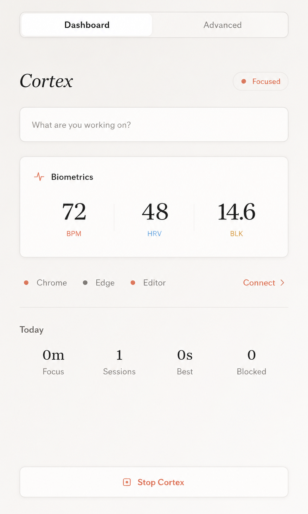
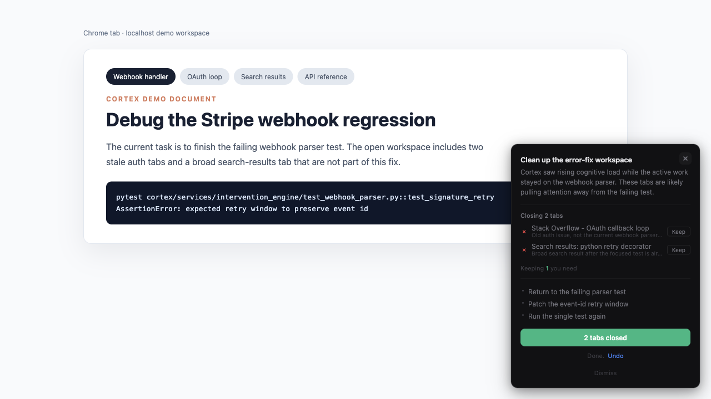
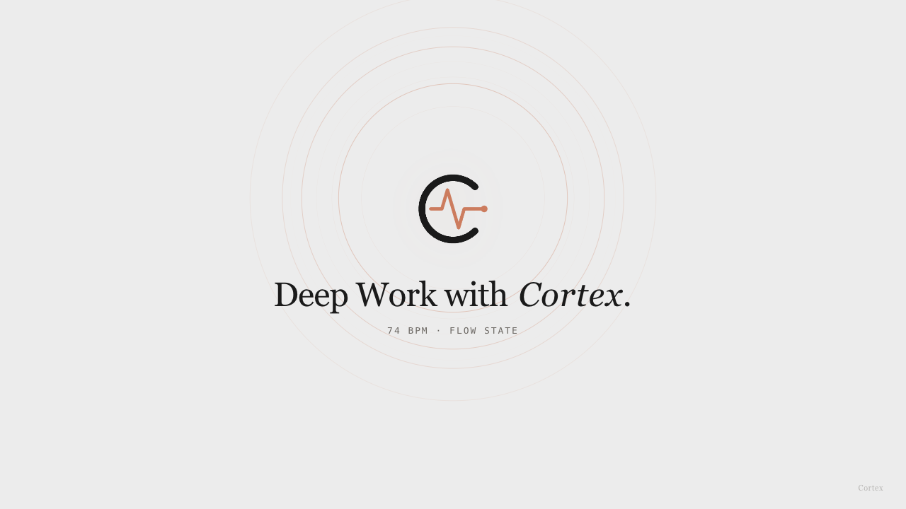

<p align="center">
  
</p>

<h1 align="center">Cortex — The Biological Browser Engine</h1>

<p align="center">
  Real-time biofeedback for macOS. Reads cognitive overwhelm from your face and webcam at 30 FPS, then lets Claude restructure your workspace.
</p>

<p align="center">
  <a href="https://github.com/StevenWang-CY/cortex/actions/workflows/ci.yml">
    
  </a>
  <a href="https://github.com/StevenWang-CY/cortex/releases/latest">
    
  </a>
  <a href="LICENSE"></a>
  
  
  
  
  
</p>

<p align="center">
  <a href="https://github.com/StevenWang-CY/cortex/releases/latest">Download DMG</a> &nbsp;·&nbsp;
  <a href="https://github.com/StevenWang-CY/cortex/wiki">Wiki</a> &nbsp;·&nbsp;
  <a href="audit/findings.md">Audit ledger</a> &nbsp;·&nbsp;
  <a href="CHANGELOG.md">Changelog</a> &nbsp;·&nbsp;
  <a href="cortex/docs/apis.md">API reference</a>
</p>

---

## Demo

<!-- TODO(media): replace with real captures. See assets/demo/README.md for capture guidance. -->

<p align="center">
  
</p>

<table>
  <tr>
    <td width="33%" align="center">
      
      <sub><b>Desktop dashboard</b><br/>HR, HRV, blink rate, posture in real time</sub>
    </td>
    <td width="33%" align="center">
      
      <sub><b>Intervention overlay</b><br/>Causal explanation, per-tab recommendations, single-CTA execute, undo</sub>
    </td>
    <td width="33%" align="center">
      
      <sub><b>Pulse Room (new tab)</b><br/>Central orb pulses at your live HR; ambient ECG-style trace</sub>
    </td>
  </tr>
</table>

---

## Engineering highlights

- **Schema codegen drift gate.** Pydantic models in
  [`cortex/libs/schemas/`](cortex/libs/schemas/) are the single source
  of truth for every shape that crosses the daemon ↔ browser-extension
  boundary; a custom generator emits the TypeScript `.d.ts`. Stale
  generated output is rejected by **both** the pre-commit hook and a
  required CI job — a class of bug it makes structurally impossible.
- **Capability-token auth, end-to-end correlation IDs.** Every
  mutating HTTP route and the WebSocket handshake gate on a 256-bit
  token (`mode 0600` at `~/Library/Application Support/Cortex/auth.token`,
  rotatable from the UI). Each mutating request is assigned an
  `X-Cortex-Request-ID` that surfaces in dashboard error toasts so
  users can quote the cid back when filing issues.
- **AMIP — Adaptive Microrandomized Intervention Policy.** Contextual
  Thompson sampling over fixed intervention arms with temperature
  softmax, deterministic safety floor, propensity logging, and a
  write-ahead policy log for off-policy evaluation; nightly causal
  reports written locally. Implemented from scratch in
  [`cortex/services/eval/amip.py`](cortex/services/eval/amip.py).
- **Four rPPG algorithms** — POS / CHROM / GREEN / TS-CAN (ONNX) with
  peer-reviewed citations; composite SQI vetoes physiology before
  publication; 60-second-window HRV (RMSSD, SDNN, pNN50, SD1/SD2,
  LF/HF via Lomb-Scargle, sample entropy).
- **Multi-layer kill chain.** Stopping the daemon executes
  WebSocket `SHUTDOWN` → HTTP `/shutdown` → Chrome native-messaging
  `stop` → SIGTERM-by-port-and-name → SIGKILL survivors, with
  bounded waits between each layer. Documented in
  [`CLAUDE.md`](CLAUDE.md) rule #13.
- **Hard CI gates.** `ruff` + 124 pytest files (1,334 test functions)
  + 17 vitest specs + schema-codegen drift + eval-regression baseline
  (synthetic-trace replay with 3 % relative tolerance) on every PR.
  `mypy` runs as an informational check.
- **Cross-language stack** with intent: Python (FastAPI + PySide6) ·
  TypeScript (Plasmo MV3 + VS Code) · C (`.cortex_launcher.c` for
  macOS TCC identity) · ONNX Runtime (TS-CAN inference).
- **56 / 56 audit findings closed** across 2 sessions, plus 2
  Architectural Debts (schema codegen, capability-token auth) — see
  [`audit/state.md`](audit/state.md). The ledger is the design-process
  artifact, not vapourware.

---

## Key features

- **Bio-extraction at 30 FPS** — HR / HRV / respiratory rate via rPPG; blink rate, head pose, posture via MediaPipe; mouse/keyboard via pynput. Gracefully degrades to telemetry-only in poor lighting.
- **Cognitive state classification** — fuses signals every 500 ms into FLOW · HYPER (overwhelmed) · HYPO (disengaged) · RECOVERY using rule-based scoring with EMA smoothing, Schmitt hysteresis, and per-user calibration.
- **LLM-powered interventions** — workspace context (never biometrics) is sent to Claude via the Anthropic SDK (Bedrock default, Vertex or direct API supported); structured JSON output, schema-validated, schema-degraded on parse failure. Closes distraction tabs, groups related tabs, surfaces error fixes, decomposes tasks into micro-steps.
- **LeetCode mode** — DOM observer, stage inference (READ / PLAN / IMPLEMENT / DEBUG / REFLECT), amygdala-hijack lockout, pattern-ladder hints, submission-discipline guard.
- **Biology-driven breaks** — cumulative HRV-suppression integral replaces arbitrary Pomodoro timers.
- **Progressive consent** — 5-level trust ladder per action type (OBSERVE → SUGGEST → PREVIEW → REVERSIBLE_ACT → AUTONOMOUS_ACT). Cortex earns autonomy through repeated approvals; rejections de-escalate.
- **Learning loop** — AMIP selects the intervention arm; per-tab relevance tracker learns from Keep-button feedback (EMA, 90-day TTL).
- **Ambient somatic feedback** — sub-threshold color vignettes, weather particles, flow shield that fades distractions during sustained focus.
- **Chrome + Edge extension** — Plasmo / React MV3 with popup, intervention overlay, Pulse Room new tab, focus sessions, activity tracker, resume cards.

---

## How it works

```
Webcam (30 FPS)
     │
     ▼
L1: Bio-Extraction ─── rPPG (POS/CHROM/GREEN + optional TS-CAN/ONNX) · Respiration · Blink/PERCLOS · Pose · Telemetry
     │
     ▼  SQI Gate (NSQI + SNR + motion + face-loss) → FeatureVector (500 ms)
L2: State Engine ────── Personalized scoring · optional ML ensemble · calibrated confidence
     │
     ▼  StateEstimate + stress_integral
L3: Trigger Policy ──── Receptivity gate · dwell/hysteresis · adaptive threshold · AMIP
     │
     ▼  TaskContext
L4: LLM Engine ──────── Anthropic SDK (Bedrock / Vertex / direct) · schema-constrained output · grounded explanations · self-critique · rule-based fallback
     │
     ▼  InterventionPlan
L5: Intervention ────── Recency-weighted consent · single-CTA execute · undo stack · reward logging
     │
     ▼
Store (Redis / in-memory + policy WAL + nightly causal reports)
```

All layers communicate via FastAPI (`:9472`) and WebSocket (`:9473`),
both bound to `127.0.0.1` and gated by capability token. The desktop
shell, VS Code extension, and Chrome / Edge extension are all clients.

Deep dives: [How It Works](https://github.com/StevenWang-CY/cortex/wiki/How-It-Works) ·
[Architecture](https://github.com/StevenWang-CY/cortex/wiki/Architecture) ·
[API reference](cortex/docs/apis.md) ·
[Calibration](https://github.com/StevenWang-CY/cortex/wiki/Calibration) ·
[Privacy](https://github.com/StevenWang-CY/cortex/wiki/Privacy)

---

## Tech stack

| Layer | Technologies |
|-------|-------------|
| **Backend** | Python 3.11+, FastAPI, MediaPipe, OpenCV, ONNX Runtime, pynput, PySide6 |
| **Browser extension** | TypeScript, React, Plasmo (Manifest V3) — Chrome + Edge |
| **VS Code extension** | TypeScript, VS Code Extension API |
| **LLM** | Anthropic SDK over AWS Bedrock (default), GCP Vertex, or direct Anthropic API; deterministic rule-based fallback |
| **Storage** | Redis 7+ with automatic in-memory fallback |
| **Testing** | pytest (124 test files, 1,334 test functions) + vitest (17 specs); mypy `--strict`; ruff |
| **CI gates** | schema-codegen drift · python (ruff + mypy + pytest) · eval-regression baseline · all required for merge |

---

## Why I built this

<!-- EDIT THIS PARAGRAPH — rewrite in your own voice before publishing -->

Existing focus tools are either dumb timers (Pomodoro doesn't know you
just hit a deep flow state at minute 24) or anxiety-machines that
nag you for "task switching" without ever asking your body whether it
was actually a problem. I wanted a system that read me first and
nagged me second — one that could see I was thrashing between tabs
*because my heart rate was climbing* and intervene with something
specific (close these four tabs, the error is on line 67, you've been
holding your breath for two minutes), not generic ("Time for a
break!"). Building it also meant getting my hands dirty in a stack I
hadn't touched together before: real-time signal processing, on-device
ML, browser-extension architecture, async + Qt + native macOS,
adversarial code audits. The version-control history is the project,
not the binary.

---

## Status

- **What works.** State classification is conservative and well-tuned in testing (no false alarms during caffeinated studying, debugging sessions, deep reading). Biology-driven break timer, LeetCode multi-selector DOM observer, intervention matrix, context-aware LLM fallback, progressive-consent ladder all behave as designed.
- **Known limits.** Webcam rPPG is sensitive to lighting / motion / camera quality; HRV at 30 FPS is trend-level, not clinical-grade beat-level. UBFC / PURE replay tests are dataset-gated. Intervention copy can be generic early on before the learning loop calibrates.
- **Not yet.** Linux / Windows support (the whole stack is tied to AVFoundation, TCC, and macOS-specific frameworks). No multi-user / cloud sync — by design (everything stays local).

---

## Install

1. Download **Cortex.dmg** from the [latest release](https://github.com/StevenWang-CY/cortex/releases/latest).
2. Drag **Cortex.app** to `/Applications`.
3. Strip quarantine: `xattr -cr /Applications/Cortex.app`.
4. Open Cortex — follow the 4-step setup wizard (Camera, Accessibility, API key, Extensions).

That's it — no terminal, no Python, no Node.js required. The daemon
runs in-process inside Cortex.app; the browser extension's
**Start Cortex** button launches the installed `.app` automatically
(`open -a Cortex.app`) and reuses its in-process daemon.

---

## Developer setup (from source)

> Most users should use the **DMG installer** above. This section is
> for developers who want to modify Cortex.

### Prerequisites

| Requirement | How to install |
|-------------|----------------|
| **macOS 13+** | required (Ventura or later) |
| **Python 3.11 or 3.12** | `brew install python@3.11` |
| **Node.js 18+** | `brew install node` |
| **pnpm** | `npm install -g pnpm` |
| **LLM backend** | one of: AWS Bedrock bearer token (default), GCP Vertex application-default credentials, or direct Anthropic API key. Falls back to a deterministic rule-based plan if every provider is unavailable. |
| **Redis** (optional) | `brew install redis && brew services start redis` — falls back to in-memory automatically |

> **Apple Silicon:** use native ARM Python, not Rosetta. Verify with `python3 -c "import platform; print(platform.machine())"` — should print `arm64`.

### One-shot setup

```bash
git clone https://github.com/StevenWang-CY/cortex.git
cd cortex

make setup            # creates .venv, installs Python + pnpm deps, seeds storage
make precommit        # installs pre-commit hook (schema-codegen drift gate)

cp cortex/.env.example .env   # then set CORTEX_LLM__PROVIDER and credentials
make dev              # start the daemon
```

`make help` shows every shortcut.

### Configuring the LLM provider

Cortex talks to Claude exclusively through the Anthropic SDK. Pick
one transport in `.env`:

```bash
CORTEX_LLM__PROVIDER=bedrock        # default — AWS Bedrock (bearer token in macOS Keychain)
# CORTEX_LLM__PROVIDER=vertex       # GCP Vertex AI (gcloud auth application-default login)
# CORTEX_LLM__PROVIDER=direct       # Anthropic API (ANTHROPIC_API_KEY env var)
```

For Bedrock, store the bearer token in macOS Keychain (one-time):

```bash
security add-generic-password -s cortex.bedrock -a bearer_token -w YOUR_BEDROCK_TOKEN
```

When every provider fails, Cortex falls back to a deterministic
rule-based plan (`CORTEX_LLM__FALLBACK_MODE=rule_based`, the default)
so the daemon keeps working.

### Browser extension

```bash
make ext              # Chrome MV3 production build
make ext-edge         # Edge MV3 production build
make ext-dev          # Plasmo hot-reload dev mode

# Install native messaging (one-time, auto-detects all browsers)
python -m cortex.scripts.install_native_host
# Then fully restart your browser (Cmd+Q, reopen).
```

Then load `cortex/apps/browser_extension/build/chrome-mv3-prod/` (or `edge-mv3-prod/`) at `chrome://extensions` with Developer mode enabled.

### Tests + quality

```bash
make ci               # everything CI runs (lint + typecheck + tests + codegen drift)
make test             # pytest suite
make test-eval        # AMIP / IPS / safety-floor / calibration
make codegen-check    # schema drift gate
```

### Build a DMG

```bash
make dmg              # produces dist/Cortex.dmg
```

For production distribution, set `CORTEX_SIGN_IDENTITY` to your
Developer ID certificate and `CORTEX_NOTARIZE_PROFILE` to your
notarytool keychain profile before running `make dmg`.

---

## Privacy

- **No video is ever saved.** Frames are processed in memory and immediately discarded.
- **No biometrics reach the LLM.** The model sees only workspace context: file paths, error messages, tab titles.
- **Local-only network surface.** FastAPI, WebSocket, and the launcher agent bind to `127.0.0.1` and require a capability token.
- **Consent-gated autonomy.** No action executes without earned trust. Users control the maximum autonomy level. Destructive actions are reversible.

See [Privacy](https://github.com/StevenWang-CY/cortex/wiki/Privacy) and [SECURITY.md](SECURITY.md) for the full boundary commitments.

---

## Contributing

Bug reports, ideas, and patches welcome. Start with [CONTRIBUTING.md](CONTRIBUTING.md).

For security issues, please use [GitHub Security Advisories](https://github.com/StevenWang-CY/cortex/security/advisories/new) instead of a public issue.

This is a personal portfolio project on best-effort support — see [SUPPORT.md](SUPPORT.md).

---

## License

[MIT](LICENSE) © 2026 Steven Wang. Third-party attribution in [NOTICE](NOTICE).
