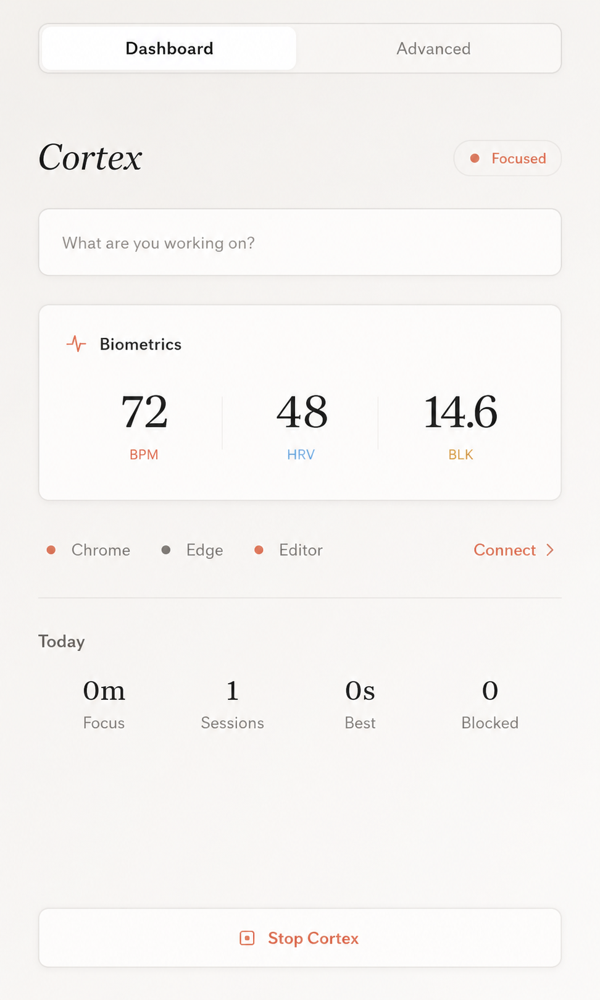
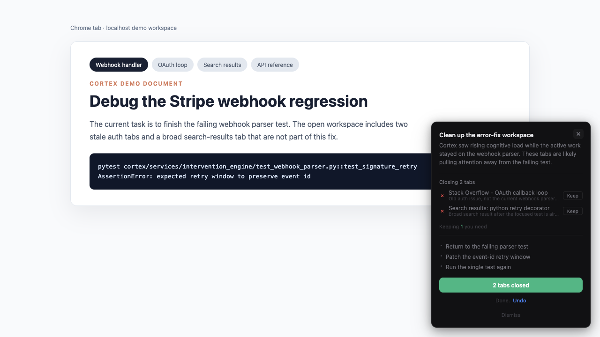
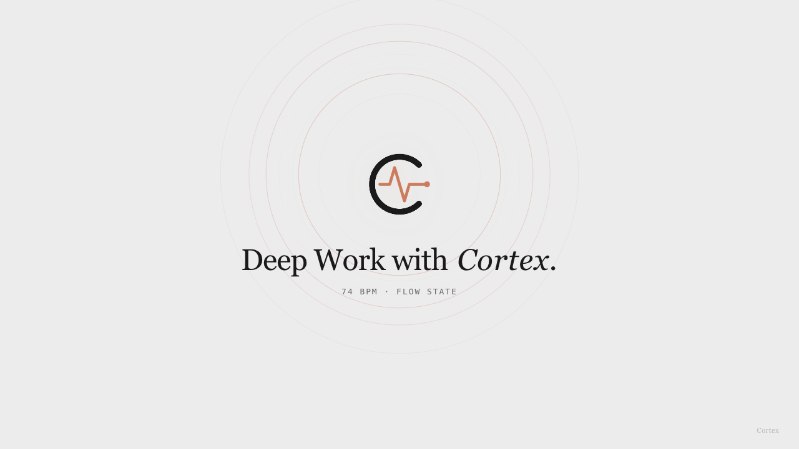

<p align="center">
  
</p>

<h1 align="center">Cortex — A Local Workspace Support Engine</h1>

<p align="center">
  A macOS research prototype that combines local camera and activity signals with workspace context to offer conservative, user-controlled suggestions.
</p>

<p align="center">
  <a href="https://github.com/StevenWang-CY/cortex/actions/workflows/ci.yml">
    
  </a>
  <a href="https://github.com/StevenWang-CY/cortex/releases/latest">
    
  </a>
  <a href="LICENSE"></a>
  
  
  
  
  
</p>

<p align="center">
  <a href="https://github.com/StevenWang-CY/cortex/releases/latest">Download DMG</a> &nbsp;·&nbsp;
  <a href="https://github.com/StevenWang-CY/cortex/wiki">Wiki</a> &nbsp;·&nbsp;
  <a href="audit/findings.md">Audit ledger</a> &nbsp;·&nbsp;
  <a href="CHANGELOG.md">Changelog</a> &nbsp;·&nbsp;
  <a href="cortex/docs/apis.md">API reference</a>
</p>

---

## Demo

<table>
  <tr>
    <td width="33%" align="center">
      
      <sub><b>Desktop dashboard</b><br/>Quality-gated pulse, blink rate, and session stats</sub>
    </td>
    <td width="33%" align="center">
      
      <sub><b>Intervention overlay</b><br/>Evidence summary, per-tab suggestions, and explicit user review</sub>
    </td>
    <td width="33%" align="center">
      
      <sub><b>Pulse Room (new tab)</b><br/>Central orb pulses at your live HR; ripple field and ECG-mark motif</sub>
    </td>
  </tr>
</table>

---

## Engineering highlights

- **Schema codegen drift gate.** Pydantic models in
  [`cortex/libs/schemas/`](cortex/libs/schemas/) are the single source
  of truth for every shape that crosses the daemon ↔ browser-extension
  boundary; a custom generator emits the TypeScript `.d.ts`. Stale
  generated output is rejected by **both** the pre-commit hook and a
  required CI job — a class of bug it makes structurally impossible.
- **Capability-token auth, end-to-end correlation IDs.** Every
  mutating HTTP route and the WebSocket handshake gate on a 256-bit
  token (`mode 0600` at `~/Library/Application Support/Cortex/auth.token`,
  rotatable from the UI). Each mutating request is assigned an
  `X-Cortex-Request-ID` that surfaces in dashboard error toasts so
  users can quote the cid back when filing issues.
- **Research policy instrumentation.** The repository contains contextual
  policy and propensity-logging experiments. Their current reports are
  diagnostics, not causal evidence, and production defaults do not grant
  them workspace authority.
- **Conservative physiology boundary.** Quality-gated webcam pulse can be
  displayed as an experimental wellness signal. Camera-derived HRV,
  respiration, LF/HF, apnea, and the former stress-integral trigger are
  unavailable until metric-specific reference-sensor validation passes.
- **Multi-layer kill chain.** Stopping the daemon executes
  WebSocket `SHUTDOWN` → HTTP `/shutdown` → Chrome native-messaging
  `stop` → SIGTERM-by-port-and-name → SIGKILL survivors, with
  bounded waits between each layer. The lifecycle invariants are documented in
  [`AGENTS.md`](AGENTS.md) and tested on the shutdown paths.
- **Hard CI gates.** Python lint/type/tests, schema and version drift,
  browser type/tests/build, VS Code compile/tests/package, regression
  replay, and dependency-policy artifacts run on changes before release.
- **Cross-language stack** with intent: Python (FastAPI + PySide6) ·
  TypeScript (Plasmo MV3 + VS Code) · C (`.cortex_launcher.c` for
  the legacy macOS TCC wrapper).
- **Tracked redesign.** [`IMPLEMENTATION.md`](IMPLEMENTATION.md) records
  the current algorithm/architecture audit, evidence limits, invariants,
  work packages, risk register, and objective exit gates.

---

## Key features

- **Local sensing** — quality-gated pulse plus blink, head-pose, and input/window telemetry. Missing or poor-quality camera data degrades explicitly.
- **Evidence-aware support estimates** — fixed-denominator behavior scores,
  explicit unknown/warm-up states, provenance, coverage, and a fail-closed
  rollback; never calibrated probabilities or diagnoses.
- **Preview-gated LLM proposals** — model networking is off by default. In
  external mode, the user inspects one exact redacted payload and provider
  caveat, confirms it once, and receives a locally validated proposal.
- **LeetCode mode** — DOM observer, stage inference (READ / PLAN / IMPLEMENT / DEBUG / REFLECT), user-controlled stuck-state support, pattern-ladder hints, and submission review.
- **Suggestion-only authority** — fresh and migrated installs cannot mutate tabs, editors, windows, or files from a proposal. Higher modes remain explicit and guarded while transactional authorization is completed.
- **Exact consent outcomes** — permit, downgrade, and deny are distinct; a downgraded request cannot execute its original plan.
- **Ambient workspace feedback** — restrained, reduced-motion-aware color and
  particle cues shown only while a support estimate is available; missing
  evidence renders neutrally.
- **Chrome + Edge extension** — Plasmo / React MV3 with popup, intervention overlay, Pulse Room new tab, focus sessions, activity tracker, resume cards.

---

## How it works

```
Webcam (30 FPS)
     │
     ▼
L1: Observation ─────── quality-gated rPPG pulse · Blink/PERCLOS · Pose · Telemetry
     │
     ▼  SQI Gate (NSQI + SNR + motion + face-loss) → FeatureVector (500 ms)
L2: Support Engine ──── Heuristic scoring · smoothing · evidence/quality gates
     │
     ▼  Support proposal
L3: Trigger Policy ──── Receptivity gate · dwell/hysteresis · deterministic safeguards
     │
     ▼  TaskContext
L4: LLM Engine ──────── Anthropic SDK (Bedrock / Vertex / direct) · schema-constrained output · grounded explanations · self-critique · rule-based fallback
     │
     ▼  InterventionPlan
L5: Intervention ────── Proposal-only default · exact consent · restore planning
     │
     ▼
Store (single-owner SQLite authority + bounded compatibility caches)
```

All layers communicate via FastAPI (`:9472`) and WebSocket (`:9473`),
both bound to `127.0.0.1` and gated by capability token. The desktop
shell, VS Code extension, and Chrome / Edge extension are all clients.

Deep dives: [How It Works](https://github.com/StevenWang-CY/cortex/wiki/How-It-Works) ·
[Architecture](https://github.com/StevenWang-CY/cortex/wiki/Architecture) ·
[API reference](cortex/docs/apis.md) ·
[Calibration](https://github.com/StevenWang-CY/cortex/wiki/Calibration) ·
[Privacy](https://github.com/StevenWang-CY/cortex/wiki/Privacy)

---

## Tech stack

| Layer | Technologies |
|-------|-------------|
| **Backend** | Python 3.11/3.12, FastAPI, MediaPipe, OpenCV, ONNX Runtime, pynput, PySide6 |
| **Browser extension** | TypeScript, React, Plasmo (Manifest V3) — Chrome + Edge |
| **VS Code extension** | TypeScript, VS Code Extension API |
| **LLM** | Anthropic SDK over AWS Bedrock (default), GCP Vertex, or direct Anthropic API; deterministic rule-based fallback |
| **Storage** | Transactional SQLite authority; Redis/in-memory only for compatibility or ephemeral caches |
| **Testing** | pytest + Vitest + Jest; strict mypy; Ruff; contract/replay/fault gates |
| **CI gates** | locked dual-architecture install · schema/config/link/version drift · Python/browser/editor gates · dependency policy |

---

## Why I built this

<!-- EDIT THIS PARAGRAPH — rewrite in your own voice before publishing -->

Existing focus tools often ignore context. Cortex explores whether local
signals and workspace structure can support better-timed, more specific
suggestions without pretending that webcam measurements diagnose a mental
state. Building it combines real-time signal processing, browser-extension
architecture, async + Qt + native macOS, privacy boundaries, and adversarial
code audits. The version-control history is the project, not the binary.

---

## Status

- **What works.** Local capture/telemetry, quality-gated pulse, schema-validated planning, proposal presentation, capability-token auth, and deterministic cleanup paths have automated coverage.
- **Known limits.** This is an alpha research prototype. Webcam pulse is sensitive to lighting, motion, skin/camera conditions, and is not medical grade. Support labels are heuristic. HRV, respiration/apnea, LF/HF, and physiology-triggered breaks are disabled pending external validation.
- **Safety default.** `execution_mode=suggest_only`; proposals do not close/hide tabs, fold editors, or otherwise restructure the workspace.
- **Not yet.** Linux / Windows support (the whole stack is tied to AVFoundation, TCC, and macOS-specific frameworks). No multi-user / cloud sync — by design (everything stays local).

---

## Install

1. Download the correct **Cortex-&lt;version&gt;-macos-&lt;arch&gt;.dmg** and its evidence from the [latest release](https://github.com/StevenWang-CY/cortex/releases/latest).
2. Open the DMG and drag **Cortex.app** to **Applications**. If Finder asks,
   replace the older copy; do not leave the new build only on the mounted disk
   image.
3. Eject the Cortex disk image, then launch `/Applications/Cortex.app` (not the
   copy under `/Volumes/Cortex`). Use Finder **Get Info** if you need to confirm
   the installed version.
4. Verify the checksum/attestation and open Cortex. A notarized release should not require stripping quarantine.
5. Follow the setup wizard (Camera, Accessibility, optional BYOK, Extensions).

That's it — no terminal, no Python, no Node.js required. The daemon
runs in-process inside Cortex.app; the browser extension's
**Start Cortex** button launches the installed `.app` automatically
(`open -a Cortex.app`) and reuses its in-process daemon.

If the Dock icon bounces and Cortex does not remain open, inspect
`~/Library/Logs/Cortex/last-startup-error.txt` and
`~/Library/Logs/Cortex/startup.log`. Current builds show a startup error dialog
with the same diagnostic reference; include that reference and the installed
version in a bug report. Never use `tccutil reset Camera` as a generic fix.

---

## Developer setup (from source)

> Most users should use the **DMG installer** above. This section is
> for developers who want to modify Cortex.

### Prerequisites

| Requirement | How to install |
|-------------|----------------|
| **macOS 13+** | required (Ventura or later) |
| **Python 3.11.15** | primary `.python-version`; CI also validates 3.12.13 |
| **uv 0.10.12** | `brew install uv` |
| **Node.js 22.23.2** | match `.node-version` with your version manager |
| **pnpm 9.15.9** | `corepack prepare pnpm@9.15.9 --activate` |
| **LLM backend** | one of: AWS Bedrock bearer token (default), GCP Vertex application-default credentials, or direct Anthropic API key. Falls back to a deterministic rule-based plan if every provider is unavailable. |

> **Apple Silicon:** use native ARM Python, not Rosetta. Verify with `python3 -c "import platform; print(platform.machine())"` — should print `arm64`.

### One-shot setup

```bash
git clone https://github.com/StevenWang-CY/cortex.git
cd cortex

make setup            # consumes uv/pnpm/npm locks and seeds storage
make precommit        # installs pre-commit hook (schema-codegen drift gate)

cp cortex/.env.example .env   # optional overrides; all generated lines are commented
make dev              # start the daemon
```

`make help` shows every shortcut.

### Configuring the LLM provider

Cortex talks to Claude exclusively through the Anthropic SDK. Pick
one transport in `.env`:

```bash
CORTEX_LLM__PROVIDER=bedrock        # default — AWS Bedrock (bearer token in macOS Keychain)
# CORTEX_LLM__PROVIDER=vertex       # GCP Vertex AI (gcloud auth application-default login)
# CORTEX_LLM__PROVIDER=direct       # Anthropic API (ANTHROPIC_API_KEY env var)
```

For Bedrock, store the bearer token in macOS Keychain (one-time):

```bash
security add-generic-password -s cortex.bedrock -a bearer_token -w YOUR_BEDROCK_TOKEN
```

When every provider fails, Cortex falls back to a deterministic
rule-based plan (`CORTEX_LLM__FALLBACK_MODE=rule_based`, the default)
so the daemon keeps working.

### Browser extension

```bash
make ext              # Chrome MV3 production build
make ext-edge         # Edge MV3 production build
make ext-dev          # Plasmo hot-reload dev mode

# Install native messaging (one-time, auto-detects all browsers)
python -m cortex.scripts.install_native_host
# Then fully restart your browser (Cmd+Q, reopen).
```

Then load `cortex/apps/browser_extension/build/chrome-mv3-prod/` (or `edge-mv3-prod/`) at `chrome://extensions` with Developer mode enabled.

### Tests + quality

```bash
make ci               # everything CI runs (lint + typecheck + tests + codegen drift)
make test             # pytest suite
make test-eval        # policy diagnostics / safety-floor / calibration
make codegen-check    # schema drift gate
```

### Build a DMG

```bash
make dmg              # produces dist/Cortex-<version>-macos-<arch>.dmg
```

For production distribution, set `CORTEX_SIGN_IDENTITY` to your
Developer ID certificate and `CORTEX_NOTARIZE_PROFILE` to your
notarytool keychain profile before running `make dmg`.

---

## Privacy

- **No video is ever saved.** Frames are processed in memory and immediately discarded.
- **No raw biometrics reach the LLM.** Camera frames, landmarks, waveforms,
  IBIs, and raw physiological observations are absent from the planner
  contract. An explicitly selected support status is a heuristic label, not a
  biometric stream.
- **External context is off by default.** The default deterministic planner
  makes no model-network call. External mode requires revision-bound setup,
  per-source selection, an exact redacted preview, and one-time confirmation.
- **Browser page content is per-site.** Activity telemetry stays
  metadata-only; page-body excerpts require an explicit grant for the current
  HTTP(S) origin and are never collected in incognito.
- **Local-only network surface.** FastAPI, WebSocket, and the launcher agent bind to `127.0.0.1` and require a capability token.
- **User authority.** The shipped default is suggestion-only. A model response
  never grants authority; any enabled effect needs a separate exact manifest,
  authorization, receipt, verification, and restore lifecycle.

See [Privacy](cortex/docs/privacy.md), [Security](cortex/docs/security.md),
[UI design](cortex/docs/ui-design.md), and [SECURITY.md](SECURITY.md) for the
full boundary commitments.

---

## Contributing

Bug reports, ideas, and patches welcome. Start with [CONTRIBUTING.md](CONTRIBUTING.md).

For security issues, please use [GitHub Security Advisories](https://github.com/StevenWang-CY/cortex/security/advisories/new) instead of a public issue.

This is a personal portfolio project on best-effort support — see [SUPPORT.md](SUPPORT.md).

---

## License

[MIT](LICENSE) © 2026 Steven Wang. Third-party attribution in [NOTICE](NOTICE).
