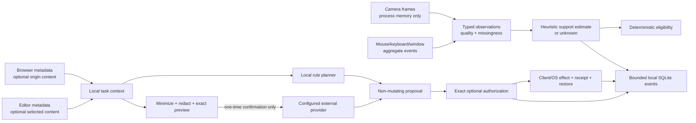

# Data flow and deletion map

This document names the implemented flows in Cortex 0.3.3. The canonical
external-context disclosure is [cortex/docs/privacy.md](../cortex/docs/privacy.md);
security controls are in [cortex/docs/security.md](../cortex/docs/security.md).

## Source-by-source handling

| Source | Collected form | Ordinary persistence | External egress |
| --- | --- | --- | --- |
| Camera | Frames, landmarks, ROI color traces and quality in process memory | No raw frames, landmarks or waveforms; bounded derived status/events only | Never in planner contract |
| Mouse/keyboard | Timing/rate/variance aggregates; no key text | Bounded features/status where enabled | Only named support status, never raw input events |
| Window/app | Active app and transition aggregates | Bounded events | Optional aggregate category after preview |
| Browser activity | Sanitized title/origin/path, tab type, dwell/resume metadata | Browser local storage capped at 200 records | Metadata only when selected and previewed |
| Browser page content | Bounded active-page excerpt after exact origin permission | Current snapshot only; revocation scrubs content fields | Only when selected, redacted, previewed, and confirmed once |
| Editor | Basename/symbol/diagnostic metadata; optional bounded visible code | Current snapshot; no repository mirror | Selected fields only through broker |
| Terminal | Detected bounded error summary | Current snapshot | Selected error summary only; no command history/raw terminal |
| User goal/note | User-entered bounded text | Current session/settings as applicable | Only when selected and previewed |
| Credentials | Provider-standard environment during construction or macOS Keychain | Keychain/provider store | Only to the selected provider's authentication endpoint |

## Local authority and stores

SQLite under the configured storage root is authoritative for intervention
transactions, policy decision/delivery/outcome/reward lifecycles, migrations,
and bounded operational events. It uses a single owner, rollback journaling,
`synchronous=FULL`, integrity checks, verified pre-migration backups, retention,
and recovery. Receipts store only the inverse state needed to verify/restore a
Cortex-owned effect; they should not contain file or page bodies.

Legacy JSON/JSONL is imported only through checksummed migration or retained as
descriptive diagnostics. Redis/in-memory stores are compatibility or ephemeral
caches, not authority for v2 transactions. Logs record identifiers, health,
counts, missing reasons, provider/status metadata, and redaction counts—not raw
frames, prompts, page bodies, source code, key text, or credentials.

## Network boundary

HTTP 9472, WebSocket 9473, and optional launcher 9471 bind to `127.0.0.1`.
Operational and mutation routes require a local capability token; WebSocket
clients authenticate before identification. Native messaging uses bounded,
generated request/response shapes. Loopback is a transport boundary, not a
trust assumption: all client/provider payloads remain untrusted.

The only intended cloud content flow is the configured Anthropic SDK transport
after `external_redacted` preview confirmation. Update/notarization/GitHub
traffic belongs to distribution tooling, not the running planner.

## Export, deletion, uninstall

The authenticated storage maintenance path supports scoped export and a typed
destructive confirmation: `DELETE CORTEX DATA`. It refuses to erase evidence
needed for an unresolved restore transaction. A complete user deletion must:

1. stop Cortex and restore or explicitly acknowledge unresolved effects;
2. delete the configured SQLite/storage root and verified backups through the
   maintenance API/UI;
3. clear browser extension local storage and revoke optional site permissions;
4. uninstall the browser native-host manifests/copies and VS Code extension;
5. remove Cortex Keychain items if the user requests credential deletion;
6. remove `/Applications/Cortex.app` and any downloaded DMGs;
7. confirm no app process owns ports 9471–9473 or the camera.

Dragging the app to Trash alone does not delete browser/editor data, native
host manifests, Keychain credentials, or the configured storage root. Release
validation records every step without including private content.
